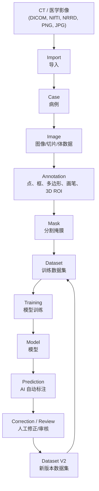

# C组 Day1 标准：数据流、文件组织与统一命名

## 1. 文档目的

本文档是 C 组 Day1 的基础开发契约。后续平台开发、数据库设计、接口设计、AI 训练、数据集导出、跨组联调都必须按照这份标准执行。

C 组的核心职责是“医学影像标注与数据管理”。系统需要接收 A 组、B 组或本地导入的 CT/医学影像数据，完成人工标注、AI 自动标注、人工修正、版本管理、质量评价，并最终导出可训练、可复现、可追溯的数据集。

## 2. 整个系统的数据流



简化版：

```text
CT(DICOM/NIfTI/NRRD/PNG/JPG)
  -> Import
  -> Case
  -> Image
  -> Annotation
  -> Mask
  -> Dataset
  -> Training
  -> Model
  -> Prediction
  -> Correction
  -> Dataset V2
```

以后所有开发都按照这条主线理解数据：

- 前端不是随便画图，而是在 `Image` 上创建 `Annotation`。
- 后端不是随便存文件，而是把 `Case`、`Image`、`Annotation`、`Mask`、`Version`、`Dataset` 串起来。
- AI 不是随便读取图片，而是从标准化后的 `Dataset` 读取训练数据。
- 人工修正不是覆盖旧结果，而是生成新的版本和新的数据集发布。

## 3. 每个数据阶段的含义

| 阶段 | 含义 | 主要产物 |
| --- | --- | --- |
| CT / 医学影像 | 原始输入，可来自 A 组、B 组、公开数据集或本地上传。 | 原始影像文件、空间信息、病例元数据。 |
| Import | 导入文件，识别格式，校验 spacing/origin/direction，注册病例。 | 病例记录、图像记录、原始文件路径。 |
| Case | 一个病例级单位，后续图像、标注、mask、版本、导出都归属于病例。 | `Case0001` 这类稳定病例 ID。 |
| Image | 一个二维切片或一个三维体数据。 | `Image0001` 这类稳定图像 ID。 |
| Annotation | 人工或 AI 产生的可编辑标注，包括点、框、多边形、画笔、3D ROI。 | 标注 JSON 或数据库标注记录。 |
| Mask | 由标注或 AI 推理生成的像素/体素级分割结果。 | PNG、NIfTI、NRRD 等 mask 文件。 |
| Dataset | 由图像和 mask 组成的训练数据集，必须包含固定 train/val/test 划分。 | 数据集目录、划分文件、manifest 文件。 |
| Training | AI 模型训练过程，只读取标准 dataset。 | 训练日志、模型 checkpoint。 |
| Model | 已训练的分割模型。 | 模型文件、模型版本、评价指标。 |
| Prediction | 模型对病例生成的 AI 标注结果。 | AI mask、概率图、不确定性图。 |
| Correction | 人工对 AI 结果进行修正、审核、确认。 | 新标注版本、新 corrected mask。 |
| Dataset V2 | 修正后重新导出的新版本数据集。 | 新的不可变数据集发布版本。 |

## 4. 顶层文件组织

项目根目录固定如下：

```text
label_platform/
  backend/
  frontend/
  ai/
  dataset/
  database/
  docs/
  README.md
```

### 目录职责

| 目录 | 负责人 | 作用 |
| --- | --- | --- |
| `backend/` | Person A | 后端接口、病例管理、标注保存、mask 保存、版本管理、数据集导出。 |
| `frontend/` | Person A | Web 标注界面、病例列表、CT 浏览器、工具栏、mask 叠加、版本显示。 |
| `ai/` | Person B | 预处理、Dataset、DataLoader、训练脚本、推理脚本、模型文件。 |
| `dataset/` | Person A + Person B | 全组统一数据根目录。AI 后续只能从这里读取标准化数据。 |
| `database/` | Person A | ER 图、数据库表设计、迁移脚本、种子数据、数据库说明。 |
| `docs/` | Person A + Person B | 数据标准、API 文档、UI 原型说明、流程图、联调约定。 |

## 5. Dataset 目录规范

基础结构固定如下：

```text
dataset/
  raw/
  images/
  labels/
  splits/
```

### 子目录说明

| 目录 | 存放内容 | 规则 |
| --- | --- | --- |
| `dataset/raw/` | 原始导入文件，例如 DICOM、NIfTI、NRRD、PNG/JPG。 | 原始数据只读保存，不直接修改。 |
| `dataset/images/` | 预处理后的训练图像，例如 NIfTI、PNG 切片或模型输入文件。 | 由导入/预处理/导出流程生成，AI 从这里读取图像。 |
| `dataset/labels/` | 人工标注、AI 标注、人工修正、最终审核的 mask/label。 | 文件名必须包含 Case、Image、Mask、Version、Label 信息。 |
| `dataset/splits/` | train/val/test 划分文件。 | 必须按病例划分，不能按切片随机混合。 |

后续建议扩展为：

```text
dataset/
  raw/
    Case0001/
      image/
      mask_initial/
      metadata.json
  images/
    Case0001/
      Case0001_Image0001.nii.gz
  labels/
    Case0001/
      v1_manual/
      v2_ai/
      v3_fusion/
      final/
  splits/
    Dataset0001_split.json
    Dataset0001_manifest.json
    Dataset0001_label_map.json
```

关键约定：

- `dataset/raw/` 保存原始数据。
- `dataset/images/` 保存预处理后的训练图像。
- `dataset/labels/` 保存各版本 mask/label。
- `dataset/splits/` 保存 train/val/test 病例划分。
- AI 不允许从前端临时目录、上传临时目录、个人电脑随机路径读取数据。

## 6. 统一命名规范

### 6.1 核心 ID

统一采用“实体名 + 四位数字”的格式。

| 实体 | 格式 | 示例 |
| --- | --- | --- |
| 病例 | `Case%04d` | `Case0001` |
| 图像 | `Image%04d` | `Image0001` |
| 标注 | `Annotation%04d` | `Annotation0001` |
| Mask | `Mask%04d` | `Mask0001` |
| 数据集 | `Dataset%04d` | `Dataset0001` |
| 模型 | `Model%04d` | `Model0001` |
| 版本 | `v1_manual`、`v2_ai`、`v3_fusion`、`final` | `v3_fusion` |

禁止使用下面这种不清晰命名：

```text
001.png
mask.png
new_mask.png
final_final.png
test1.nii.gz
```

### 6.2 文件命名格式

通用格式：

```text
<CaseID>_<ImageID>_<ObjectID>_<Version>_<Label>.<ext>
```

二维 mask 示例：

```text
Case0001_Image0001_Mask0001_v1_manual_lung_nodule.png
Case0001_Image0001_Mask0002_v2_ai_lung_nodule.png
Case0001_Image0001_Mask0003_v3_fusion_lung_nodule.png
Case0001_Image0001_Mask0004_final_lung_nodule.png
Case0001_Image0001_Annotation0001_v1_manual_lung_nodule.json
```

三维体数据示例：

```text
Case0001_Image0001_Mask0001_final_liver.nii.gz
Case0001_Image0001_Mask0002_v2_ai_tumor.nii.gz
```

### 6.3 标签命名

标签统一使用小写 snake_case。

推荐：

```text
background
left_lung
right_lung
liver
left_kidney
right_kidney
spleen
lung_nodule
tumor
calcification
inflammation
hemorrhage
cyst
```

不要使用：

```text
Left Lung
left-lung
lungNodule
tumour1
lesion_new
```

### 6.4 版本命名

版本名称固定如下：

| 版本 | 含义 | 来源 |
| --- | --- | --- |
| `v1_manual` | 人工手动标注版本。 | 标注人员。 |
| `v2_ai` | AI 自动标注版本。 | 模型预测。 |
| `v3_fusion` | 人工修正 AI 后的融合版本。 | AI 结果 + 人工修正。 |
| `final` | 审核通过的最终版本。 | reviewer/admin 确认。 |

默认只有 `final` 版本用于正式数据集导出、E 组特征提取、D 组统计分析、F 组问答解释。

## 7. Annotation 与 Mask 格式规范

| 数据类型 | 推荐格式 | 说明 |
| --- | --- | --- |
| 2D 图像切片 | PNG | 用于前端显示和二维实验。 |
| 3D 医学影像 | NIfTI `.nii.gz` | 推荐作为三维医学体数据标准格式。 |
| DICOM 输入 | DICOM 文件夹 | 原始文件保留在 `dataset/raw/`。 |
| 可编辑标注 | JSON | 保存点、框、多边形、画笔操作、创建者、时间、版本。 |
| 2D mask | PNG | 像素值必须对应 `label_map.json`。 |
| 3D mask | NIfTI `.nii.gz` | 必须保持 spacing、origin、direction、shape 对齐。 |
| 数据集清单 | JSON | 记录病例、划分、标签、版本、文件路径。 |

## 8. 病例元数据标准

每个病例后续应有一个 `metadata.json`。

最小字段如下：

```json
{
  "case_id": "Case0001",
  "patient_id": "Patient0001",
  "modality": "CT",
  "body_part": "lung",
  "source_group": "A",
  "image_format": "DICOM",
  "spacing": [1.0, 1.0, 1.0],
  "origin": [0.0, 0.0, 0.0],
  "direction": [1.0, 0.0, 0.0, 0.0, 1.0, 0.0, 0.0, 0.0, 1.0],
  "annotation_status": "unannotated",
  "created_time": "YYYY-MM-DDTHH:mm:ss"
}
```

病例状态统一为：

```text
unannotated
annotating
annotated
reviewed
exported
archived
```

## 9. 数据集发布规则

每次正式导出数据集时，都要生成一个 release 文件夹。

```text
dataset/splits/
  Dataset0001_manifest.json
  Dataset0001_split.json
  Dataset0001_label_map.json
  Dataset0001_export_log.json
```

`manifest.json` 示例：

```json
{
  "dataset_id": "Dataset0001",
  "dataset_name": "lung_nodule_segmentation_v1",
  "version_source": "final",
  "created_by": "PersonA",
  "created_time": "YYYY-MM-DDTHH:mm:ss",
  "cases": [
    {
      "case_id": "Case0001",
      "image_path": "dataset/images/Case0001/Case0001_Image0001.nii.gz",
      "mask_path": "dataset/labels/Case0001/final/Case0001_Image0001_Mask0001_final_lung_nodule.nii.gz",
      "split": "train"
    }
  ]
}
```

数据集导出前必须检查：

- 图像文件存在。
- mask 文件存在。
- 图像和 mask 尺寸一致。
- 图像和 mask 的 spacing/origin/direction 一致。
- label 编号与 `label_map.json` 一致。
- train/val/test 不存在同一病例泄漏。
- 导出的 mask 默认来自 `final` 版本。

## 10. Day1 确认清单

Person A 和 Person B 开始写业务代码前，必须共同确认：

- 主数据流固定为：Import -> Case -> Image -> Annotation -> Mask -> Dataset -> Training -> Model -> Prediction -> Correction -> Dataset V2。
- 所有共享数据都放在 `dataset/` 下。
- AI 只读取标准化后的 `dataset/images/`、`dataset/labels/` 和 `dataset/splits/`。
- 病例 ID 使用 `Case0001` 格式。
- 图像 ID 使用 `Image0001` 格式。
- Mask ID 使用 `Mask0001` 格式。
- 标签使用小写 snake_case。
- 版本只使用 `v1_manual`、`v2_ai`、`v3_fusion`、`final`。
- 正式导出默认使用 `final` mask。
- train/val/test 按病例划分，不按切片随机划分。
- mask 与 image 在导出前必须通过空间一致性检查。

## 11. Person A 下一步

完成本文档后，Person A 的下一步是：

1. 画 ER 图：`users`、`cases`、`images`、`annotations`、`masks`、`models`、`datasets`、`versions`。
2. 写 REST API 文档：上传、病例查询、图像查询、mask 保存/读取、版本管理、质量评价、数据集导出。
3. 画平台原型图：病例列表、CT 浏览器、标注工具栏、mask 叠加、AI 标注按钮、保存按钮、版本列表、导出入口。
