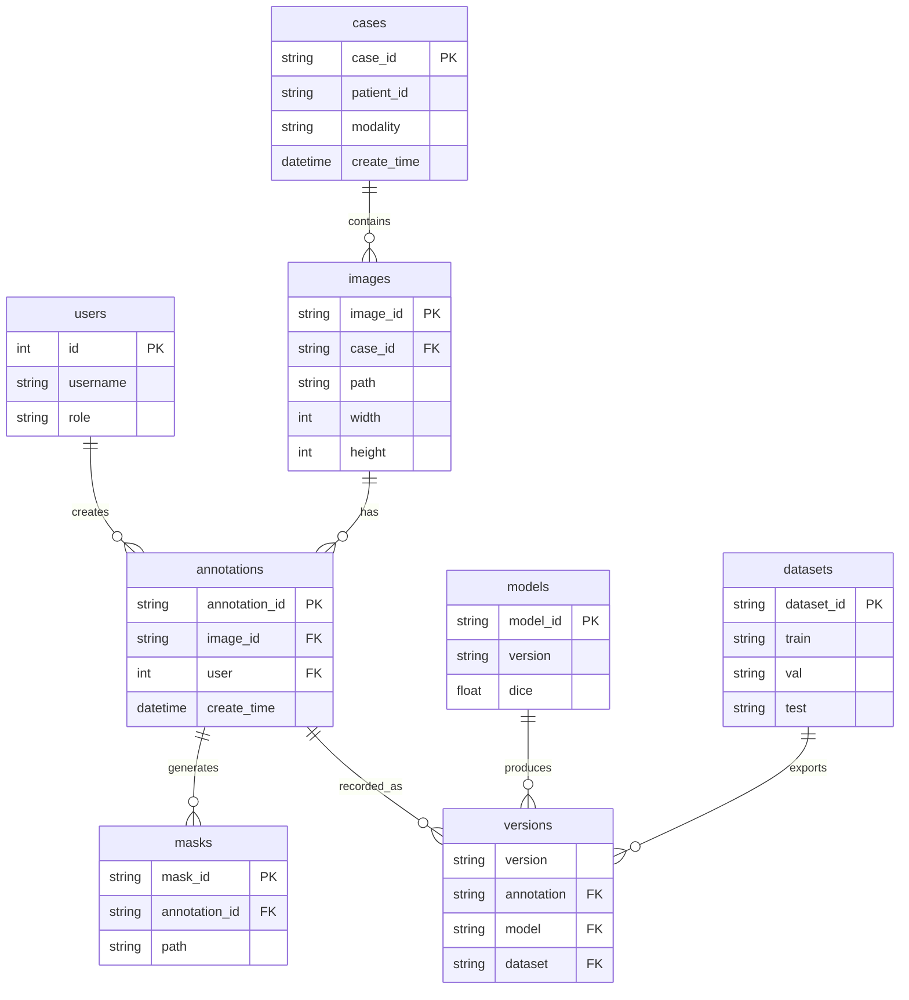
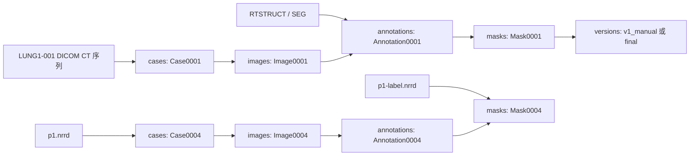

# 数据库设计：Day1 ER 图

## 1. 设计目标

今天只做数据库设计，不写 SQL，不建库。

本阶段数据库只保留八张核心表：

```text
users
cases
images
annotations
masks
models
datasets
versions
```

设计原则：

- `cases` 是病例中心。
- `images` 归属于病例。
- `annotations` 归属于图像，并记录创建用户。
- `masks` 由 annotation 生成。
- `models` 记录 AI 模型版本和效果。
- `datasets` 记录 train/val/test 划分。
- `versions` 负责把 annotation、model、dataset 串起来。

## 2. ER 图



## 3. 表字段说明

### 3.1 users

用户表，记录标注人员、审核人员、管理员和 AI 服务账号。

| 字段 | 含义 | 示例 |
| --- | --- | --- |
| `id` | 用户 ID | `1` |
| `username` | 用户名 | `alice` |
| `role` | 角色 | `annotator`、`reviewer`、`admin`、`ai_service` |

### 3.2 cases

病例表，一个病例对应一个内部 `CaseID`。

| 字段 | 含义 | 示例 |
| --- | --- | --- |
| `case_id` | 内部病例 ID | `Case0001` |
| `patient_id` | 外部病人 ID | `LUNG1-001` |
| `modality` | 影像类型 | `CT` |
| `create_time` | 创建时间 | `2026-06-29 12:00:00` |

样例数据映射：

```text
LUNG1-001 -> Case0001
LUNG1-002 -> Case0002
LUNG1-003 -> Case0003
patient1  -> Case0004
```

### 3.3 images

图像表，一个病例可以有多个图像记录。DICOM CT 序列、NRRD 体数据、处理后的 PNG/NIfTI 都可以登记为 image。

| 字段 | 含义 | 示例 |
| --- | --- | --- |
| `image_id` | 图像 ID | `Image0001` |
| `case_id` | 所属病例 | `Case0001` |
| `path` | 图像路径 | `example_data/LUNG1-001/.../0.000000-NA-82046/` |
| `width` | 宽度 | `512` |
| `height` | 高度 | `512` |

说明：

- DICOM 序列可以把 `path` 指向序列文件夹。
- NRRD/NIfTI 可以把 `path` 指向具体文件。
- 3D 深度、spacing、origin、direction 暂不进八表，先放 metadata 文件，后续需要再扩展。

### 3.4 annotations

标注表，记录一次标注行为或一次 AI 生成结果。

| 字段 | 含义 | 示例 |
| --- | --- | --- |
| `annotation_id` | 标注 ID | `Annotation0001` |
| `image_id` | 被标注图像 | `Image0001` |
| `user` | 创建用户 | `1` 或 `ai_service` 对应用户 ID |
| `create_time` | 创建时间 | `2026-06-29 12:10:00` |

### 3.5 masks

Mask 表，保存标注结果对应的 mask 文件路径。

| 字段 | 含义 | 示例 |
| --- | --- | --- |
| `mask_id` | Mask ID | `Mask0001` |
| `annotation_id` | 来源标注 | `Annotation0001` |
| `path` | mask 文件路径 | `dataset/labels/Case0001/final/Case0001_Image0001_Mask0001_final_lung_nodule.nii.gz` |

样例数据映射：

- DICOM `SEG` 可以导入为 mask。
- DICOM `RTSTRUCT` 可以先转为 mask，再登记到 masks。
- `p1-label.nrrd` 可以直接登记为 mask。

### 3.6 models

模型表，记录 AI 模型版本和基础效果。

| 字段 | 含义 | 示例 |
| --- | --- | --- |
| `model_id` | 模型 ID | `Model0001` |
| `version` | 模型版本 | `unet_v1` |
| `dice` | Dice 指标 | `0.86` |

### 3.7 datasets

数据集表，记录一次 train/val/test 划分。

| 字段 | 含义 | 示例 |
| --- | --- | --- |
| `dataset_id` | 数据集 ID | `Dataset0001` |
| `train` | 训练集病例 | `Case0001,Case0002` |
| `val` | 验证集病例 | `Case0003` |
| `test` | 测试集病例 | `Case0004` |

Day1 可以先用字符串或 JSON 思路描述 `train`、`val`、`test`。后续真正建库时，如果数据集复杂，再拆成 dataset_items 表。

### 3.8 versions

版本表，记录一次标注版本与模型、数据集之间的关系。

| 字段 | 含义 | 示例 |
| --- | --- | --- |
| `version` | 版本名 | `v1_manual`、`v2_ai`、`v3_fusion`、`final` |
| `annotation` | 对应标注 | `Annotation0001` |
| `model` | 来源模型，可为空 | `Model0001` |
| `dataset` | 所属数据集，可为空 | `Dataset0001` |

版本规则：

- `v1_manual`：人工标注。
- `v2_ai`：AI 自动标注。
- `v3_fusion`：人工修正 AI 后的版本。
- `final`：审核通过，可导出数据集的版本。

注意：`version` 不是全局唯一值。不同病例、不同 annotation 都可能有 `v1_manual`。Day1 不新增字段的前提下，先约定由 `version + annotation` 共同确定一条版本记录。后续真正建库时，如果需要更强扩展性，可以再增加 `version_id`。

## 4. 样例数据导入后的逻辑关系



## 5. Day1 结论

这八张表可以支撑今天后续 API 和 UI 原型设计：

- 上传 CT：写入 `cases` 和 `images`。
- 保存标注：写入 `annotations`。
- 保存 mask：写入 `masks`。
- AI 推理：写入 `models`、`annotations`、`masks`、`versions`。
- 导出数据集：写入 `datasets` 和 `versions`。

今天不写 SQL。真正建库前，先让 Person A 和 Person B 确认这张 ER 图。
