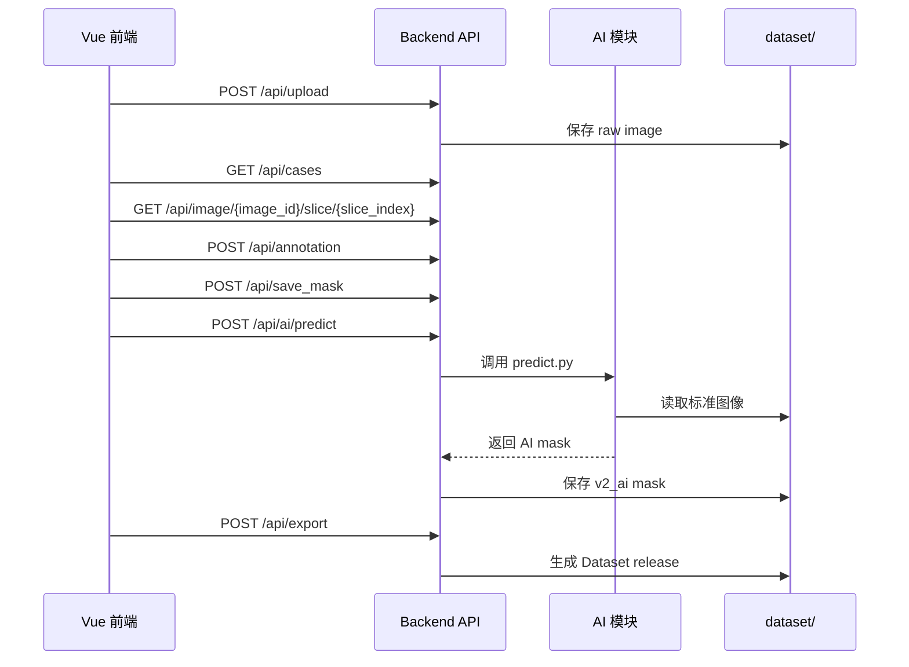

# API 设计文档：Day1 接口契约

## 1. 设计目标

今天只写接口文档，不写 FastAPI 代码。

接口要同时满足：

- Vue 前端调用：上传、查看病例、浏览 CT、保存标注、显示 mask。
- AI 模块调用：读取 dataset、保存预测 mask、导出训练数据。
- 后续 F 组调用：自然语言触发自动标注、查询版本、导出数据集。

统一约定：

- API 前缀：`/api`
- 请求和响应默认使用 JSON。
- 上传文件使用 `multipart/form-data`。
- 内部 ID 使用 `Case0001`、`Image0001`、`Annotation0001`、`Mask0001`。
- 正式导出默认使用 `final` 版本 mask。

## 2. 核心接口总览

| 功能 | 方法 | 路径 | 调用方 |
| --- | --- | --- | --- |
| 上传 CT/医学影像 | POST | `/api/upload` | Vue、A/B 组 |
| 查询病例列表 | GET | `/api/cases` | Vue、F 组 |
| 查询病例详情 | GET | `/api/case/{case_id}` | Vue、F 组 |
| 查询图像信息 | GET | `/api/image/{image_id}` | Vue |
| 查询 3D 体数据元信息 | GET | `/api/image/{image_id}/volume` | Vue、AI |
| 获取 WebGL2 体渲染数据 | GET | `/api/image/{image_id}/volume-data` | Vue |
| 获取切片图像 | GET | `/api/image/{image_id}/slice/{slice_index}.png` | Vue |
| 获取三轴切片图像 | GET | `/api/image/{image_id}/slice/{axis}/{slice_index}.png` | Vue |
| 获取三轴 MIP/MinIP 投影 | GET | `/api/image/{image_id}/projection/{axis}.png` | Vue、AI |
| 导出 3D 原始图像 | GET | `/api/image/{image_id}/export-3d` | Vue、AI |
| 创建标注记录 | POST | `/api/annotation` | Vue、AI |
| 保存 Mask | POST | `/api/save_mask` | Vue、AI |
| 查询 Mask | GET | `/api/mask/{mask_id}` | Vue、AI、E 组 |
| 查询某图像 Mask 列表 | GET | `/api/image/{image_id}/masks` | Vue |
| 保存版本 | POST | `/api/version` | Vue、AI |
| 查询版本列表 | GET | `/api/case/{case_id}/versions` | Vue、F 组 |
| 运行 AI 自动标注 | POST | `/api/ai/predict` | Vue、F 组 |
| 导出 Dataset | POST | `/api/export` | Vue、AI、F 组 |

## 3. 上传 CT

### POST `/api/upload`

用途：上传 DICOM 文件夹压缩包、NIfTI、NRRD、PNG/JPG，导入后创建 `case` 和 `image`。

请求类型：

```text
multipart/form-data
```

请求字段：

| 字段 | 类型 | 必填 | 说明 |
| --- | --- | --- | --- |
| `file` | file | 是 | DICOM zip、NIfTI、NRRD、PNG/JPG。 |
| `source_group` | string | 否 | `A`、`B`、`local`。 |
| `patient_id` | string | 否 | 外部病人 ID，例如 `LUNG1-001`。 |
| `modality` | string | 否 | 默认从文件读取，例如 `CT`。 |

响应：

```json
{
  "success": true,
  "case_id": "Case0001",
  "image_id": "Image0001",
  "patient_id": "LUNG1-001",
  "modality": "CT",
  "path": "dataset/raw/Case0001/image/",
  "width": 512,
  "height": 512,
  "message": "upload success"
}
```

样例数据适配：

- `LUNG1-001` 的 CT DICOM 序列导入后生成 `Case0001` 和 `Image0001`。
- `patient1/p1.nrrd` 导入后生成一个 3D image。
- 如果上传中包含 `RTSTRUCT`、`SEG` 或 `p1-label.nrrd`，应继续生成 annotation 和 mask 记录。

## 4. 查询病例

### GET `/api/cases`

用途：获取病例列表。

查询参数：

| 参数 | 类型 | 必填 | 说明 |
| --- | --- | --- | --- |
| `status` | string | 否 | `unannotated`、`annotating`、`reviewed` 等。 |
| `keyword` | string | 否 | 搜索 `case_id` 或 `patient_id`。 |

响应：

```json
{
  "success": true,
  "image_id": "Image0001",
  "count": 2,
  "items": [
    {
      "case_id": "Case0001",
      "patient_id": "LUNG1-001",
      "modality": "CT",
      "create_time": "2026-06-29T12:00:00",
      "image_count": 1,
      "mask_count": 2,
      "status": "annotating"
    }
  ]
}
```

### GET `/api/case/{case_id}`

用途：获取单个病例详情。

响应：

```json
{
  "success": true,
  "case": {
    "case_id": "Case0001",
    "patient_id": "LUNG1-001",
    "modality": "CT",
    "create_time": "2026-06-29T12:00:00"
  },
  "images": [
    {
      "image_id": "Image0001",
      "path": "dataset/raw/Case0001/image/",
      "width": 512,
      "height": 512
    }
  ]
}
```

## 5. 查询图像与切片

### GET `/api/image/{image_id}`

用途：获取图像元信息。

响应：

```json
{
  "success": true,
  "image": {
    "image_id": "Image0001",
    "case_id": "Case0001",
    "path": "dataset/raw/Case0001/image/",
    "width": 512,
    "height": 512,
    "slice_count": 134
  }
}
```

### GET `/api/image/{image_id}/volume`

用途：获取 3D 体数据的真实尺寸、层数和读取来源。

响应：

```json
{
  "success": true,
  "image_id": "Image0001",
  "case_id": "Case0001",
  "width": 512,
  "height": 512,
  "slice_count": 134,
  "spacing": [1.0, 1.0, 1.0],
  "origin": [0.0, 0.0, 0.0],
  "source": "SimpleITK",
  "file_format": "nrrd",
  "path": "dataset/raw/Case0001/image.nrrd"
}
```

说明：

- 后端优先用 SimpleITK 读取 DICOM / NRRD / NIfTI。
- 如果本机未安装 SimpleITK，开发环境会对 NRRD 和 ZIP 内 NRRD 使用轻量读取器。

### GET `/api/image/{image_id}/slice/{slice_index}.png`

用途：前端 CT 浏览器请求轴位某一层切片，等价于 `axis=axial`。

查询参数：

| 参数 | 类型 | 必填 | 说明 |
| --- | --- | --- | --- |
| `window` | string | 否 | `auto`、`lung`、`soft`、`bone`，默认 `auto`。 |

响应方式：

```text
image/png
```

### GET `/api/image/{image_id}/slice/{slice_index}/values`

用途：前端智能选择 Magic Wand 请求当前轴位切片的原始 CT 灰度/HU 值，用于基于点击点的区域生长。

响应：

```json
{
  "success": true,
  "image_id": "Image0002",
  "case_id": "Case0002",
  "axis": "axial",
  "slice_index": 42,
  "width": 512,
  "height": 512,
  "scalar_type": "float32",
  "value_min": -1024.0,
  "value_max": 1800.0,
  "values_base64": "..."
}
```

说明：

- `values_base64` 是按 `y, x` 顺序展开的 `float32` 数组。
- 前端第一阶段智能选择使用 `seed HU ± threshold` 和 4 邻域连通区域生长。
- 前端阈值滑块范围为 `10~200 HU`。
- 场景默认值：
  - 肺部 / 空气边界：`HU ± 100`，推荐范围 `80~120`。
  - 骨骼：`HU ± 180`，推荐范围 `120~250`。
  - 软组织：`HU ± 45`，推荐范围 `25~50`。
  - 血管 / 实质器官：`HU ± 45`，推荐范围 `30~60`。
  - 脑窗：`HU ± 25`，推荐范围 `15~35`。
- 第二阶段再接 MedSAM / nnU-Net / Person B 模型。

### GET `/api/image/{image_id}/volume-data`

用途：给前端 WebGL2 体渲染使用，返回下采样后的真实 3D 体素数据。

兼容说明：`/api/image/{image_id}/vtk-volume` 暂时保留为旧前端缓存兼容别名，实际渲染引擎已经切换为 WebGL2，不再加载 vtk.js。

查询参数：

| 参数 | 类型 | 必填 | 说明 |
| --- | --- | --- | --- |
| `max_dim` | int | 否 | 下采样后最大维度，默认 `144`，后端限制在 `64~192`。前端 3D 视图默认请求 `176`。 |
| `window` | string | 否 | `volume`、`lung`、`soft`、`bone`、`auto`。`volume` 使用 `[-1000, 1800] HU`，更适合综合体渲染。 |
| `isotropic` | bool | 否 | 是否启用各向同性重采样，默认 `false`。前端 3D 视图请求 `true`。 |
| `target_spacing` | float | 否 | 目标 spacing，单位 mm。不传时使用原始 spacing 最小值，并受 `max_dim` 限制防止体数据过大。 |

响应：

```json
{
  "success": true,
  "image_id": "Image0002",
  "case_id": "Case0002",
  "dimensions": [128, 128, 34],
  "spacing": [4.0, 4.0, 4.0],
  "origin": [0.0, 0.0, 0.0],
  "scalar_type": "uint8",
  "window": "volume",
  "resampling": {
    "requested": true,
    "applied": true,
    "original_spacing": [0.7, 0.7, 5.0],
    "target_spacing": [1.3, 1.3, 1.3],
    "size": [176, 176, 96]
  },
  "hu_range": [-1000.0, 1800.0],
  "downsample_stride": [1, 3, 3],
  "value_range": [0, 255],
  "values_base64": "..."
}
```

说明：

- `dimensions` 顺序为 `[x, y, z]`，直接对应前端 WebGL2 3D texture 的宽、高、深。
- `values_base64` 是按 `z, y, x` 内存顺序展开的 `uint8` 体素。
- `hu_range` 表示 `uint8` 值映射回 CT HU 的低高范围，前端体渲染按 HU 做医学 Transfer Function。
- `resampling` 表示体渲染数据是否经过各向同性重采样；如果环境缺少 SimpleITK 或原始 spacing 已接近各向同性，则 `applied=false`，前端仍使用原始体数据。
- 这个接口用于真正体渲染，不是单张切片预览。
- 后端按轴独立下采样，避免 Z 方向层数被过度压缩；前端 WebGL2 使用 3D texture ray casting、HU 分段 transfer function、gradient opacity、Phong 光照、阈值过滤和线性插值改善软组织层次和边界清晰度。
- 前端体渲染采用 CT Rendering Protocol Engine，目前收敛为三类：总览、软组织、骨窗。总览使用中性灰阶观察整体空间关系；软组织使用窄窗协议弱化骨遮挡、突出实质软组织；骨窗保留 150~400 HU 松质骨并延迟 Early Ray Termination。细小病灶仍应结合 2D 切片、MIP/MinIP 或 AI mask overlay 观察。
- 当前高质量 3D 路线是浏览器端 GPU WebGL2 Ray Casting。vtk.js 不再通过 CDN 动态加载，后续如切换 vtk.js，应改为 npm/Vite 本地构建；如切换 WebGPU，需要新增 WGSL shader、3D texture pipeline 和浏览器兼容检测。

说明：

- 后端可以把 DICOM/NIfTI/NRRD 切片转为 PNG 返回。
- 前端只负责显示，不直接解析医学影像格式。

### GET `/api/image/{image_id}/slice/{axis}/{slice_index}.png`

用途：前端 MPR 三平面重建请求三轴切片。

路径参数：

| 参数 | 类型 | 必填 | 说明 |
| --- | --- | --- | --- |
| `axis` | string | 是 | `axial`、`coronal`、`sagittal`。 |
| `slice_index` | int | 是 | 对应方向的切片序号，从 0 开始。 |

查询参数：

| 参数 | 类型 | 必填 | 说明 |
| --- | --- | --- | --- |
| `window` | string | 否 | `auto`、`lung`、`soft`、`bone`。 |

响应方式：

```text
image/png
```

### GET `/api/image/{image_id}/projection/{axis}.png`

用途：生成 3D 体数据在某一方向上的投影图，用于 3D 体视图预览、MIP/MinIP 诊断辅助或 AI 快速质检。

查询参数：

| 参数 | 类型 | 必填 | 说明 |
| --- | --- | --- | --- |
| `method` | string | 否 | `mip`、`mean`、`min`，默认 `mip`。 |
| `window` | string | 否 | `auto`、`lung`、`soft`、`bone`。 |

响应方式：

```text
image/png
```

### GET `/api/image/{image_id}/export-3d`

用途：导出当前图像对应的 3D 原始体数据，给 AI 训练、3D Slicer 或其他医学影像工具继续处理。

响应方式：

```text
application/octet-stream
```

说明：

- 当前最小版本直接返回上传时保存的原始 3D 文件，例如 `.nrrd`、`.nii.gz` 或包含 NRRD/DICOM 的 `.zip`。
- 后续可以扩展 `format=nifti`，用 SimpleITK 统一转换为 `.nii.gz`。

## 6. 创建标注

### POST `/api/annotation`

用途：创建一次标注记录。点、框、多边形、画笔、AI 结果都先登记为 annotation。

请求：

```json
{
  "image_id": "Image0001",
  "user": 1,
  "annotation_type": "polygon",
  "label": "lung_nodule",
  "data": {
    "slice_index": 42,
    "points": [[120, 180], [150, 190], [148, 230]]
  }
}
```

响应：

```json
{
  "success": true,
  "annotation_id": "Annotation0001",
  "create_time": "2026-06-29T12:10:00"
}
```

## 7. 保存 Mask

### POST `/api/save_mask`

用途：保存人工标注、AI 标注或人工修正后的 mask。

请求：

```json
{
  "annotation_id": "Annotation0001",
  "case_id": "Case0001",
  "image_id": "Image0001",
  "version": "v1_manual",
  "label": "label",
  "label_id": 1,
  "mask_format": "json",
  "slice_index": 42,
  "width": 512,
  "height": 512,
  "encoding": "rle",
  "mask": [[0, 1200], [1, 80], [0, 260864]],
  "points": []
}
```

响应：

```json
{
  "success": true,
  "mask_id": "Mask0001",
  "path": "dataset/labels/Case0001/v1_manual/Case0001_Image0001_Mask0001_v1_manual_label.json"
}
```

说明：

- `mask_id` 由后端自动生成，例如 `Mask0001`。
- `path` 由后端统一生成，不由前端传入。
- 当前阶段保存真实前端标注 JSON 到 `dataset/labels/{case_id}/{version}/`，并保存 metadata 到 `database/dev_masks.json`。
- 当前 JSON 路径规范固定为：`dataset/labels/Case0001/v1_manual/Case0001_Image0001_Mask0001_v1_manual_label.json`。
- JSON 内容使用 RLE：`mask` 为 `[value, count]` 列表；后续再升级为 `.nii.gz`。

## 8. 查询 Mask

### GET `/api/mask/{mask_id}`

用途：根据 mask ID 查询 mask 文件和来源。

响应：

```json
{
  "success": true,
  "mask": {
    "mask_id": "Mask0001",
    "annotation_id": "Annotation0001",
    "path": "dataset/labels/Case0001/v1_manual/Case0001_Image0001_Mask0001_v1_manual_label.json",
    "version": "v1_manual",
    "label": "label",
    "mask_format": "json",
    "slice_index": 42,
    "encoding": "rle"
  },
  "content": {
    "case_id": "Case0001",
    "image_id": "Image0001",
    "slice_index": 42,
    "label": "label",
    "encoding": "rle",
    "mask": [[0, 1200], [1, 80], [0, 260864]],
    "points": []
  }
}
```

### GET `/api/image/{image_id}/masks`

用途：前端加载当前图像的 mask 列表，用于叠加显示。

响应：

```json
{
  "success": true,
  "items": [
    {
      "mask_id": "Mask0001",
      "version": "v1_manual",
      "label": "label",
      "mask_format": "json",
      "path": "dataset/labels/Case0001/v1_manual/Case0001_Image0001_Mask0001_v1_manual_label.json"
    },
    {
      "mask_id": "Mask0002",
      "version": "v1_manual",
      "label": "label",
      "mask_format": "nii.gz",
      "path": "dataset/labels/Case0001/v1_manual/Case0001_Image0001_Mask0002_v1_manual_label.nii.gz"
    }
  ]
}
```

说明：

- 当前最小实现从 `database/dev_masks.json` 读取；文件不存在时返回空数组。

## 9. 导出 3D NIfTI Mask

### POST `/api/export_mask_nifti`

用途：把同一图像、同一版本、同一 label 下保存的多个 2D JSON slice mask 合成为 3D volume mask，并导出 `.nii.gz`。

请求：

```json
{
  "case_id": "Case0001",
  "image_id": "Image0001",
  "version": "v1_manual",
  "label": "label"
}
```

响应：

```json
{
  "success": true,
  "mask_id": "Mask0002",
  "path": "dataset/labels/Case0001/v1_manual/Case0001_Image0001_Mask0002_v1_manual_label.nii.gz",
  "source_mask_ids": ["Mask0001"],
  "shape": [120, 512, 512],
  "spacing": [0.8, 0.8, 1.5],
  "origin": [0.0, 0.0, 0.0],
  "direction": [1.0, 0.0, 0.0, 0.0, 1.0, 0.0, 0.0, 0.0, 1.0]
}
```

说明：

- 后端读取原 CT 的 `shape / spacing / origin / direction`。
- JSON slice mask 按 `slice_index` 写入 3D `mask[z, y, x]`。
- 使用 SimpleITK 写出 `.nii.gz`。
- 导出的 mask 与原 CT 使用相同 `spacing / origin / direction`，用于在 3D Slicer 中对齐。

## 10. Label Propagation

### POST `/api/label_propagate`

用途：把少量 2D sparse JSON mask 自动传播成完整 3D mask。当前 V1 使用 image-guided signed distance map：先按真实 spacing 做距离场传播，再用 CT 原图 HU 范围和形态学后处理约束结果。

请求：

```json
{
  "case_id": "Case0001",
  "image_id": "Image0001",
  "source_version": "v1_manual",
  "output_version": "v3_fusion",
  "label": "label",
  "method": "image_guided_distance",
  "fill_holes": true,
  "keep_largest_component": false,
  "image_guidance": true,
  "hu_margin": null,
  "closing_radius": 1
}
```

响应：

```json
{
  "success": true,
  "mask_id": "Mask0003",
  "path": "dataset/labels/Case0001/v3_fusion/Case0001_Image0001_Mask0003_v3_fusion_label.nii.gz",
  "method": "image_guided_distance",
  "source_mask_ids": ["Mask0001", "Mask0002"],
  "annotated_slices": [42, 61],
  "propagated_slices": 134,
  "shape": [134, 512, 512]
}
```

说明：

- 已标注切片作为 hard constraint，不被传播算法修改。
- 中间层使用 signed distance map 插值，而不是直接插值二值 mask。
- 距离场使用原 CT 的 `spacing`，层厚会影响传播范围；只有一层标注时不会再简单复制到整个体积，而会随 z 距离逐渐收缩。
- `image_guidance=true` 时，会从医生手工 mask 内估计前景 HU 范围，再过滤传播候选区域，减少传播到无关组织。
- `closing_radius` 用于二维形态学闭合，`fill_holes` 用于填洞，`keep_largest_component` 可在需要单一器官时只保留最大连通域。
- 当前版本适合课程项目和第一版 Demo；后续可替换为 Sli2Vol / SAM2-3D / MONAI 模型式传播。

### GET `/api/mask/{mask_id}/slice/{slice_index}`

用途：从 Label Propagation / DeepEdit 生成的 3D NIfTI mask 中读取某一层，用于 2D 标注工作台逐层显示传播结果。

响应：

```json
{
  "success": true,
  "mask_id": "Mask0003",
  "version": "v3_fusion",
  "slice_index": 42,
  "width": 512,
  "height": 512,
  "encoding": "rle",
  "mask": [[0, 1200], [1, 80], [0, 260864]]
}
```

说明：

- 前端切换 2D 切片时自动请求当前层传播结果。
- 传播结果会写入前端 `sliceMasks[image_id][slice_index]`，所以可以直接可视化并继续手工修正。

## 11. DeepEdit 式交互优化

### POST `/api/deepedit/refine`

用途：为后续接入 MONAI Label DeepEdit / Person B 模型预留交互式修正接口。当前 V1 先复用 Label Propagation，形成“用户新标一层 → 全局 3D mask 更新”的闭环。

请求：

```json
{
  "case_id": "Case0001",
  "image_id": "Image0001",
  "source_version": "v1_manual",
  "current_mask_version": "v3_fusion",
  "output_version": "v3_fusion",
  "label": "label",
  "positive_points": [],
  "negative_points": [],
  "confirmed_slices": [42]
}
```

说明：

- 当前 `refinement_mode=label_propagation_placeholder`。
- 后续模型版本应输入 `image_volume + current_mask + positive/negative clicks + confirmed_slices`。
- `confirmed_slices` 必须作为 hard constraint，防止模型覆盖医生已确认标注。
- 前端 3D 视图已经预留 AI Mask Overlay 区块，Person B 生成的 `v2_ai` mask 写入该 JSON 或后续数据库后即可叠加显示。

## 9. 版本管理

### POST `/api/version`

用途：保存标注版本关系。

请求：

```json
{
  "case_id": "Case0001",
  "version": "v1_manual",
  "annotation": "Annotation0001",
  "model": null,
  "dataset": null
}
```

响应：

```json
{
  "success": true,
  "version": "v1_manual",
  "item": {
    "case_id": "Case0001",
    "version": "v1_manual",
    "annotation": "Annotation0001",
    "model": null,
    "dataset": null,
    "create_time": "2026-07-01T10:00:00"
  }
}
```

说明：

- `version` 固定只能使用：`v1_manual`、`v2_ai`、`v3_fusion`、`final`。
- 同一病例同一版本重复保存时，后端会更新已有记录。

### GET `/api/case/{case_id}/versions`

用途：查询某病例的所有版本。

响应：

```json
{
  "success": true,
  "case_id": "Case0001",
  "count": 2,
  "items": [
    {
      "version": "v1_manual",
      "annotation": "Annotation0001",
      "model": null,
      "dataset": null
    },
    {
      "version": "v2_ai",
      "annotation": "Annotation0002",
      "model": "Model0001",
      "dataset": null
    }
  ]
}
```

## 10. AI 自动标注

### POST `/api/ai/predict`

用途：对某个病例或图像运行 AI 自动标注。

请求：

```json
{
  "case_id": "Case0001",
  "image_id": "Image0001",
  "model_id": "Model0001",
  "label": "lung_nodule"
}
```

响应：

```json
{
  "success": true,
  "annotation_id": "Annotation0002",
  "mask_id": "Mask0002",
  "version": "v2_ai",
  "model_id": "Model0001",
  "dice": 0.86,
  "mask_path": "dataset/labels/Case0001/v2_ai/Case0001_Image0001_Mask0002_v2_ai_lung_nodule.nii.gz"
}
```

说明：

- 当前 Person A 最小实现是占位接口：不实际运行模型，只生成 `v2_ai` mask metadata，并写入 `database/dev_masks.json` 与 `database/dev_versions.json`。
- 后续 Person B 的 `predict.py` 接入后，该接口内部改为调用真实模型，并把模型输出的 `.nii.gz` mask 保存到同一路径规范。

## 11. 导出 Dataset

### POST `/api/export`

用途：导出训练数据集。

请求：

```json
{
  "dataset_id": "Dataset0001",
  "name": "lung_nodule_segmentation_v1",
  "version": "final",
  "train": ["Case0001", "Case0002"],
  "val": ["Case0003"],
  "test": ["Case0004"],
  "format": "nnunet"
}
```

响应：

```json
{
  "success": true,
  "dataset_id": "Dataset0001",
  "output_path": "dataset/splits/Dataset0001_manifest.json",
  "train_count": 2,
  "val_count": 1,
  "test_count": 1,
  "message": "export success"
}
```

导出前检查：

- 每个病例都有 image。
- 每个病例都有指定版本 mask 记录。
- 默认使用 `final` 版本。
- train/val/test 不允许出现同一病例。
- 当前 JSON 阶段暂不强制 mask 文件真实存在，允许先导出占位 metadata；真实体素 mask 接入后，再开启 image 与 mask 的尺寸和空间一致性检查。
- 成功后生成三个文件：`dataset/splits/Dataset0001_manifest.json`、`dataset/splits/Dataset0001_split.json`、`dataset/splits/Dataset0001_label_map.json`。

## 12. 前端与 AI 的调用关系


