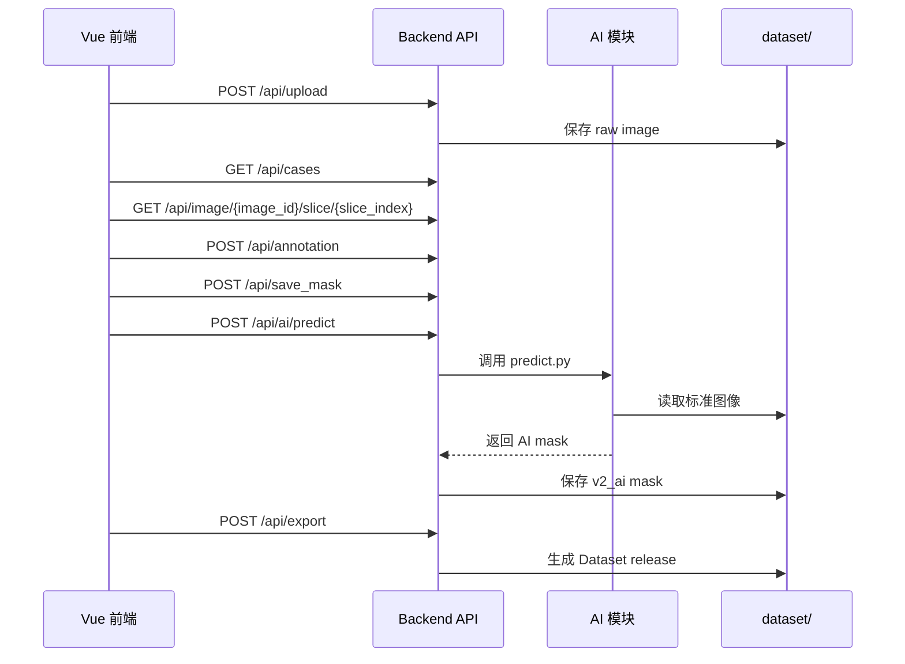

# API 设计文档：Day1 接口契约

## 1. 设计目标

今天只写接口文档，不写 FastAPI 代码。

接口要同时满足：

- Vue 前端调用：上传、查看病例、浏览 CT、保存标注、显示 mask。
- AI 模块调用：读取 dataset、保存预测 mask、导出训练数据。
- 后续 F 组调用：自然语言触发自动标注、查询版本、导出数据集。

统一约定：

- API 前缀：`/api`
- 请求和响应默认使用 JSON。
- 上传文件使用 `multipart/form-data`。
- 内部 ID 使用 `Case0001`、`Image0001`、`Annotation0001`、`Mask0001`。
- 正式导出默认使用 `final` 版本 mask。

## 2. 核心接口总览

| 功能 | 方法 | 路径 | 调用方 |
| --- | --- | --- | --- |
| 上传 CT/医学影像 | POST | `/api/upload` | Vue、A/B 组 |
| 查询病例列表 | GET | `/api/cases` | Vue、F 组 |
| 查询病例详情 | GET | `/api/case/{case_id}` | Vue、F 组 |
| 查询图像信息 | GET | `/api/image/{image_id}` | Vue |
| 查询 3D 体数据元信息 | GET | `/api/image/{image_id}/volume` | Vue、AI |
| 获取 WebGL2 体渲染数据 | GET | `/api/image/{image_id}/volume-data` | Vue |
| 获取切片图像 | GET | `/api/image/{image_id}/slice/{slice_index}.png` | Vue |
| 获取三轴切片图像 | GET | `/api/image/{image_id}/slice/{axis}/{slice_index}.png` | Vue |
| 获取三轴 MIP 投影 | GET | `/api/image/{image_id}/projection/{axis}.png` | Vue、AI |
| 导出 3D 原始图像 | GET | `/api/image/{image_id}/export-3d` | Vue、AI |
| 创建标注记录 | POST | `/api/annotation` | Vue、AI |
| 保存 Mask | POST | `/api/save_mask` | Vue、AI |
| 查询 Mask | GET | `/api/mask/{mask_id}` | Vue、AI、E 组 |
| 查询某图像 Mask 列表 | GET | `/api/image/{image_id}/masks` | Vue |
| 保存版本 | POST | `/api/version` | Vue、AI |
| 查询版本列表 | GET | `/api/case/{case_id}/versions` | Vue、F 组 |
| 运行 AI 自动标注 | POST | `/api/ai/predict` | Vue、F 组 |
| 导出 Dataset | POST | `/api/export` | Vue、AI、F 组 |

## 3. 上传 CT

### POST `/api/upload`

用途：上传 DICOM 文件夹压缩包、NIfTI、NRRD、PNG/JPG，导入后创建 `case` 和 `image`。

请求类型：

```text
multipart/form-data
```

请求字段：

| 字段 | 类型 | 必填 | 说明 |
| --- | --- | --- | --- |
| `file` | file | 是 | DICOM zip、NIfTI、NRRD、PNG/JPG。 |
| `source_group` | string | 否 | `A`、`B`、`local`。 |
| `patient_id` | string | 否 | 外部病人 ID，例如 `LUNG1-001`。 |
| `modality` | string | 否 | 默认从文件读取，例如 `CT`。 |

响应：

```json
{
  "success": true,
  "case_id": "Case0001",
  "image_id": "Image0001",
  "patient_id": "LUNG1-001",
  "modality": "CT",
  "path": "dataset/raw/Case0001/image/",
  "width": 512,
  "height": 512,
  "message": "upload success"
}
```

样例数据适配：

- `LUNG1-001` 的 CT DICOM 序列导入后生成 `Case0001` 和 `Image0001`。
- `patient1/p1.nrrd` 导入后生成一个 3D image。
- 如果上传中包含 `RTSTRUCT`、`SEG` 或 `p1-label.nrrd`，应继续生成 annotation 和 mask 记录。

## 4. 查询病例

### GET `/api/cases`

用途：获取病例列表。

查询参数：

| 参数 | 类型 | 必填 | 说明 |
| --- | --- | --- | --- |
| `status` | string | 否 | `unannotated`、`annotating`、`reviewed` 等。 |
| `keyword` | string | 否 | 搜索 `case_id` 或 `patient_id`。 |

响应：

```json
{
  "success": true,
  "items": [
    {
      "case_id": "Case0001",
      "patient_id": "LUNG1-001",
      "modality": "CT",
      "create_time": "2026-06-29T12:00:00",
      "image_count": 1,
      "mask_count": 2,
      "status": "annotating"
    }
  ]
}
```

### GET `/api/case/{case_id}`

用途：获取单个病例详情。

响应：

```json
{
  "success": true,
  "case": {
    "case_id": "Case0001",
    "patient_id": "LUNG1-001",
    "modality": "CT",
    "create_time": "2026-06-29T12:00:00"
  },
  "images": [
    {
      "image_id": "Image0001",
      "path": "dataset/raw/Case0001/image/",
      "width": 512,
      "height": 512
    }
  ]
}
```

## 5. 查询图像与切片

### GET `/api/image/{image_id}`

用途：获取图像元信息。

响应：

```json
{
  "success": true,
  "image": {
    "image_id": "Image0001",
    "case_id": "Case0001",
    "path": "dataset/raw/Case0001/image/",
    "width": 512,
    "height": 512,
    "slice_count": 134
  }
}
```

### GET `/api/image/{image_id}/volume`

用途：获取 3D 体数据的真实尺寸、层数和读取来源。

响应：

```json
{
  "success": true,
  "image_id": "Image0001",
  "case_id": "Case0001",
  "width": 512,
  "height": 512,
  "slice_count": 134,
  "spacing": [1.0, 1.0, 1.0],
  "origin": [0.0, 0.0, 0.0],
  "source": "SimpleITK",
  "file_format": "nrrd",
  "path": "dataset/raw/Case0001/image.nrrd"
}
```

说明：

- 后端优先用 SimpleITK 读取 DICOM / NRRD / NIfTI。
- 如果本机未安装 SimpleITK，开发环境会对 NRRD 和 ZIP 内 NRRD 使用轻量读取器。

### GET `/api/image/{image_id}/slice/{slice_index}.png`

用途：前端 CT 浏览器请求轴位某一层切片，等价于 `axis=axial`。

查询参数：

| 参数 | 类型 | 必填 | 说明 |
| --- | --- | --- | --- |
| `window` | string | 否 | `auto`、`lung`、`soft`、`bone`，默认 `auto`。 |

响应方式：

```text
image/png
```

### GET `/api/image/{image_id}/volume-data`

用途：给前端 WebGL2 体渲染使用，返回下采样后的真实 3D 体素数据。

查询参数：

| 参数 | 类型 | 必填 | 说明 |
| --- | --- | --- | --- |
| `max_dim` | int | 否 | 下采样后最大维度，默认 `144`，后端限制在 `64~192`。前端 3D 视图默认请求 `176`。 |
| `window` | string | 否 | `volume`、`lung`、`soft`、`bone`、`auto`。`volume` 使用 `[-1000, 1800] HU`，更适合综合体渲染。 |

响应：

```json
{
  "success": true,
  "image_id": "Image0002",
  "case_id": "Case0002",
  "dimensions": [128, 128, 34],
  "spacing": [4.0, 4.0, 4.0],
  "origin": [0.0, 0.0, 0.0],
  "scalar_type": "uint8",
  "window": "volume",
  "hu_range": [-1000.0, 1800.0],
  "downsample_stride": [1, 3, 3],
  "value_range": [0, 255],
  "values_base64": "..."
}
```

说明：

- `dimensions` 顺序为 `[x, y, z]`，直接对应前端 WebGL2 3D texture 的宽、高、深。
- `values_base64` 是按 `z, y, x` 内存顺序展开的 `uint8` 体素。
- `hu_range` 表示 `uint8` 值映射回 CT HU 的低高范围，前端体渲染按 HU 做医学 Transfer Function。
- 这个接口用于真正体渲染，不是单张切片预览。
- 后端按轴独立下采样，避免 Z 方向层数被过度压缩；前端 WebGL2 使用 3D texture ray casting、HU 分段 transfer function、gradient opacity、Phong 光照、阈值过滤和线性插值改善软组织层次和边界清晰度。

说明：

- 后端可以把 DICOM/NIfTI/NRRD 切片转为 PNG 返回。
- 前端只负责显示，不直接解析医学影像格式。

### GET `/api/image/{image_id}/slice/{axis}/{slice_index}.png`

用途：前端 3D/MPR 浏览器请求三轴切片。

路径参数：

| 参数 | 类型 | 必填 | 说明 |
| --- | --- | --- | --- |
| `axis` | string | 是 | `axial`、`coronal`、`sagittal`。 |
| `slice_index` | int | 是 | 对应方向的切片序号，从 0 开始。 |

查询参数：

| 参数 | 类型 | 必填 | 说明 |
| --- | --- | --- | --- |
| `window` | string | 否 | `auto`、`lung`、`soft`、`bone`。 |

响应方式：

```text
image/png
```

### GET `/api/image/{image_id}/projection/{axis}.png`

用途：生成 3D 体数据在某一方向上的投影图，用于 3D 体视图预览或 AI 快速质检。

查询参数：

| 参数 | 类型 | 必填 | 说明 |
| --- | --- | --- | --- |
| `method` | string | 否 | `mip`、`mean`、`min`，默认 `mip`。 |
| `window` | string | 否 | `auto`、`lung`、`soft`、`bone`。 |

响应方式：

```text
image/png
```

### GET `/api/image/{image_id}/export-3d`

用途：导出当前图像对应的 3D 原始体数据，给 AI 训练、3D Slicer 或其他医学影像工具继续处理。

响应方式：

```text
application/octet-stream
```

说明：

- 当前最小版本直接返回上传时保存的原始 3D 文件，例如 `.nrrd`、`.nii.gz` 或包含 NRRD/DICOM 的 `.zip`。
- 后续可以扩展 `format=nifti`，用 SimpleITK 统一转换为 `.nii.gz`。

## 6. 创建标注

### POST `/api/annotation`

用途：创建一次标注记录。点、框、多边形、画笔、AI 结果都先登记为 annotation。

请求：

```json
{
  "image_id": "Image0001",
  "user": 1,
  "annotation_type": "polygon",
  "label": "lung_nodule",
  "data": {
    "slice_index": 42,
    "points": [[120, 180], [150, 190], [148, 230]]
  }
}
```

响应：

```json
{
  "success": true,
  "annotation_id": "Annotation0001",
  "create_time": "2026-06-29T12:10:00"
}
```

## 7. 保存 Mask

### POST `/api/save_mask`

用途：保存人工标注、AI 标注或人工修正后的 mask。

请求：

```json
{
  "annotation_id": "Annotation0001",
  "case_id": "Case0001",
  "image_id": "Image0001",
  "version": "v1_manual",
  "label": "lung_nodule",
  "mask_format": "nii.gz",
  "path": "dataset/labels/Case0001/v1_manual/Case0001_Image0001_Mask0001_v1_manual_lung_nodule.nii.gz"
}
```

响应：

```json
{
  "success": true,
  "mask_id": "Mask0001",
  "path": "dataset/labels/Case0001/v1_manual/Case0001_Image0001_Mask0001_v1_manual_lung_nodule.nii.gz"
}
```

## 8. 查询 Mask

### GET `/api/mask/{mask_id}`

用途：根据 mask ID 查询 mask 文件和来源。

响应：

```json
{
  "success": true,
  "mask": {
    "mask_id": "Mask0001",
    "annotation_id": "Annotation0001",
    "path": "dataset/labels/Case0001/v1_manual/Case0001_Image0001_Mask0001_v1_manual_lung_nodule.nii.gz",
    "version": "v1_manual",
    "label": "lung_nodule"
  }
}
```

### GET `/api/image/{image_id}/masks`

用途：前端加载当前图像的 mask 列表，用于叠加显示。

响应：

```json
{
  "success": true,
  "items": [
    {
      "mask_id": "Mask0001",
      "version": "v1_manual",
      "label": "lung_nodule",
      "path": "dataset/labels/Case0001/v1_manual/Case0001_Image0001_Mask0001_v1_manual_lung_nodule.nii.gz"
    },
    {
      "mask_id": "Mask0002",
      "version": "v2_ai",
      "label": "lung_nodule",
      "path": "dataset/labels/Case0001/v2_ai/Case0001_Image0001_Mask0002_v2_ai_lung_nodule.nii.gz"
    }
  ]
}
```

## 9. 版本管理

### POST `/api/version`

用途：保存标注版本关系。

请求：

```json
{
  "version": "v1_manual",
  "annotation": "Annotation0001",
  "model": null,
  "dataset": null
}
```

响应：

```json
{
  "success": true,
  "version": "v1_manual"
}
```

### GET `/api/case/{case_id}/versions`

用途：查询某病例的所有版本。

响应：

```json
{
  "success": true,
  "items": [
    {
      "version": "v1_manual",
      "annotation": "Annotation0001",
      "model": null,
      "dataset": null
    },
    {
      "version": "v2_ai",
      "annotation": "Annotation0002",
      "model": "Model0001",
      "dataset": null
    }
  ]
}
```

## 10. AI 自动标注

### POST `/api/ai/predict`

用途：对某个病例或图像运行 AI 自动标注。

请求：

```json
{
  "case_id": "Case0001",
  "image_id": "Image0001",
  "model_id": "Model0001",
  "label": "lung_nodule"
}
```

响应：

```json
{
  "success": true,
  "annotation_id": "Annotation0002",
  "mask_id": "Mask0002",
  "version": "v2_ai",
  "model_id": "Model0001",
  "dice": 0.86,
  "mask_path": "dataset/labels/Case0001/v2_ai/Case0001_Image0001_Mask0002_v2_ai_lung_nodule.nii.gz"
}
```

说明：

- API 文档先确定契约。
- Day1 不实现模型推理。
- 后续 Person B 的 `predict.py` 输出结果必须能被这个接口保存。

## 11. 导出 Dataset

### POST `/api/export`

用途：导出训练数据集。

请求：

```json
{
  "dataset_id": "Dataset0001",
  "name": "lung_nodule_segmentation_v1",
  "version": "final",
  "train": ["Case0001", "Case0002"],
  "val": ["Case0003"],
  "test": ["Case0004"],
  "format": "nnunet"
}
```

响应：

```json
{
  "success": true,
  "dataset_id": "Dataset0001",
  "output_path": "dataset/splits/Dataset0001_manifest.json",
  "train_count": 2,
  "val_count": 1,
  "test_count": 1,
  "message": "export success"
}
```

导出前检查：

- 每个病例都有 image。
- 每个病例都有指定版本 mask。
- 默认使用 `final` 版本。
- train/val/test 不允许出现同一病例。
- image 与 mask 的尺寸和空间信息必须一致。

## 12. 前端与 AI 的调用关系


