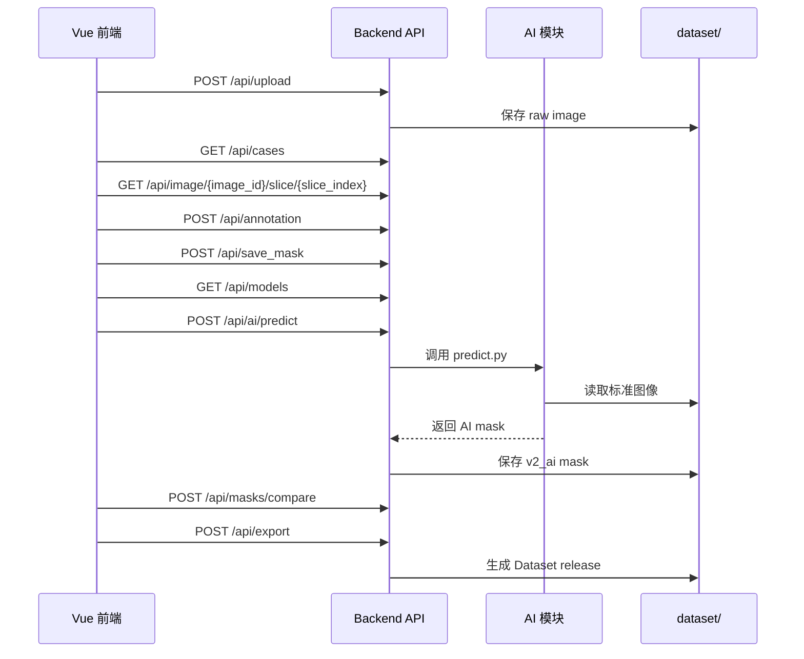

# API 设计文档：Day1 接口契约

## 1. 设计目标

今天只写接口文档，不写 FastAPI 代码。

接口要同时满足：

- Vue 前端调用：上传、查看病例、浏览 CT、保存标注、显示 mask。
- AI 模块调用：读取 dataset、保存预测 mask、导出训练数据。
- 后续 F 组调用：自然语言触发自动标注、查询版本、导出数据集。

统一约定：

- API 前缀：`/api`
- 请求和响应默认使用 JSON。
- 上传文件使用 `multipart/form-data`。
- 内部 ID 使用 `Case0001`、`Image0001`、`Annotation0001`、`Mask0001`。
- 正式导出默认使用 `final` 版本 mask。

## 2. 核心接口总览

| 功能 | 方法 | 路径 | 调用方 |
| --- | --- | --- | --- |
| 登录 | POST | `/api/auth/login` | Vue |
| 当前用户 | GET | `/api/me` | Vue |
| 用户列表 | GET | `/api/users` | Vue（admin/reviewer） |
| 创建任务 | POST | `/api/tasks` | Vue（admin/reviewer） |
| 查询任务 | GET | `/api/tasks` | Vue |
| 更新任务 | PATCH | `/api/tasks/{task_id}` | Vue |
| 提交审核 | POST | `/api/case/{case_id}/submit` | Vue（annotator/admin） |
| 审核通过 | POST | `/api/case/{case_id}/approve` | Vue（reviewer/admin） |
| 驳回 | POST | `/api/case/{case_id}/reject` | Vue（reviewer/admin） |
| 上传 CT/医学影像 | POST | `/api/upload` | Vue、A/B 组 |
| 查询病例列表 | GET | `/api/cases` | Vue、F 组 |
| 查询病例详情 | GET | `/api/case/{case_id}` | Vue、F 组 |
| 查询图像信息 | GET | `/api/image/{image_id}` | Vue |
| 查询 3D 体数据元信息 | GET | `/api/image/{image_id}/volume` | Vue、AI |
| 获取 WebGL2 体渲染数据 | GET | `/api/image/{image_id}/volume-data` | Vue |
| 获取切片图像 | GET | `/api/image/{image_id}/slice/{slice_index}.png` | Vue |
| 获取三轴切片图像 | GET | `/api/image/{image_id}/slice/{axis}/{slice_index}.png` | Vue |
| 获取三轴 MIP/MinIP 投影 | GET | `/api/image/{image_id}/projection/{axis}.png` | Vue、AI |
| 导出 3D 原始图像 | GET | `/api/image/{image_id}/export-3d` | Vue、AI |
| 创建标注记录 | POST | `/api/annotation` | Vue、AI |
| 保存 Mask | POST | `/api/save_mask` | Vue、AI |
| 更新 Mask | PUT | `/api/mask/{mask_id}` | Vue |
| 删除 Mask | DELETE | `/api/mask/{mask_id}` | Vue |
| 查询 Mask | GET | `/api/mask/{mask_id}` | Vue、AI、E 组 |
| 查询某图像 Mask 列表 | GET | `/api/image/{image_id}/masks` | Vue |
| 少量标注辅助 / AL 推荐 | GET | `/api/image/{image_id}/labeling_assist` | Vue |
| 保存版本 | POST | `/api/version` | Vue、AI |
| 查询版本列表 | GET | `/api/case/{case_id}/versions` | Vue、F 组 |
| 运行 AI 自动标注 | POST | `/api/ai/predict` | Vue、F 组 |
| 列出可用模型 | GET | `/api/models` | Vue、F 组 |
| 注册模型 | POST | `/api/models` | Vue、F 组 |
| 对比 Mask Dice/IoU | POST | `/api/masks/compare` | Vue、AI |
| 导出 Dataset | POST | `/api/export` | Vue、AI、F 组 |

## 2.1 认证、任务与审核工作流

### POST `/api/auth/login`

用途：用户名密码登录，返回 JWT（HMAC 签名）与用户角色。

演示账号（启动时自动种子写入）：

| 用户名 | 密码 | 角色 |
| --- | --- | --- |
| `annotator` | `annotator123` | 标注员 |
| `reviewer` | `reviewer123` | 审核员 |
| `admin` | `admin123` | 管理员 |

请求：

```json
{ "username": "annotator", "password": "annotator123" }
```

响应：

```json
{
  "success": true,
  "access_token": "<token>",
  "token_type": "bearer",
  "user": { "id": 3, "username": "annotator", "role": "annotator", "create_time": "..." }
}
```

后续写操作请在 Header 携带：`Authorization: Bearer <token>`。

### GET `/api/me`

返回当前登录用户。

### POST `/api/tasks` / GET `/api/tasks` / PATCH `/api/tasks/{task_id}`

用途：病例任务分配。字段包含 `case_id`、`assignee_id`、`deadline`、`status`、`note`。

- 创建任务：`admin` / `reviewer`
- 标注员仅能查看/更新自己的任务

### 病例状态机

`unannotated → annotated → pending → reviewed → final`，驳回回到 `annotated`。

| 接口 | 权限 | 状态变化 |
| --- | --- | --- |
| `POST /api/save_mask`（v1_manual） | 可选登录 | `unannotated/annotated → annotated`，并写审计 |
| `POST /api/case/{id}/submit` | annotator/admin | `annotated/reviewed → pending` |
| `POST /api/case/{id}/approve` | reviewer/admin | `pending → reviewed` |
| `POST /api/case/{id}/reject` | reviewer/admin | `pending/reviewed/final → annotated` |
| `POST /api/mask/{id}/promote` 到 `final` | reviewer/admin | `pending/reviewed → final` |

审计日志写入 `audit_logs`：保存、提交、通过、驳回、晋升、任务变更。

---

## 3. 上传 CT

### POST `/api/upload`

用途：上传 DICOM 文件夹压缩包、NIfTI、NRRD、PNG/JPG，导入后创建 `case` 和 `image`。

请求类型：

```text
multipart/form-data
```

请求字段：

| 字段 | 类型 | 必填 | 说明 |
| --- | --- | --- | --- |
| `file` | file | 是 | DICOM zip、NIfTI、NRRD、PNG/JPG。 |
| `source_group` | string | 否 | `A`、`B`、`local`。 |
| `patient_id` | string | 否 | 外部病人 ID，例如 `LUNG1-001`。 |
| `modality` | string | 否 | 默认从文件读取，例如 `CT`。 |

响应：

```json
{
  "success": true,
  "case_id": "Case0001",
  "image_id": "Image0001",
  "patient_id": "LUNG1-001",
  "modality": "CT",
  "path": "dataset/raw/Case0001/image/",
  "width": 512,
  "height": 512,
  "message": "upload success"
}
```

样例数据适配：

- `LUNG1-001` 的 CT DICOM 序列导入后生成 `Case0001` 和 `Image0001`。
- `patient1/p1.nrrd` 导入后生成一个 3D image。
- 如果上传中包含 `RTSTRUCT`、`SEG` 或 `p1-label.nrrd`，应继续生成 annotation 和 mask 记录。

## 4. 查询病例

### GET `/api/cases`

用途：获取病例列表。

查询参数：

| 参数 | 类型 | 必填 | 说明 |
| --- | --- | --- | --- |
| `status` | string | 否 | `unannotated`、`annotating`、`reviewed` 等。 |
| `keyword` | string | 否 | 搜索 `case_id` 或 `patient_id`。 |

响应：

```json
{
  "success": true,
  "image_id": "Image0001",
  "count": 2,
  "items": [
    {
      "case_id": "Case0001",
      "patient_id": "LUNG1-001",
      "modality": "CT",
      "create_time": "2026-06-29T12:00:00",
      "image_count": 1,
      "mask_count": 2,
      "status": "annotating"
    }
  ]
}
```

### GET `/api/case/{case_id}`

用途：获取单个病例详情。

响应：

```json
{
  "success": true,
  "case": {
    "case_id": "Case0001",
    "patient_id": "LUNG1-001",
    "modality": "CT",
    "create_time": "2026-06-29T12:00:00"
  },
  "images": [
    {
      "image_id": "Image0001",
      "path": "dataset/raw/Case0001/image/",
      "width": 512,
      "height": 512
    }
  ]
}
```

## 5. 查询图像与切片

### GET `/api/image/{image_id}`

用途：获取图像元信息。

响应：

```json
{
  "success": true,
  "image": {
    "image_id": "Image0001",
    "case_id": "Case0001",
    "path": "dataset/raw/Case0001/image/",
    "width": 512,
    "height": 512,
    "slice_count": 134
  }
}
```

### GET `/api/image/{image_id}/volume`

用途：获取 3D 体数据的真实尺寸、层数和读取来源。

响应：

```json
{
  "success": true,
  "image_id": "Image0001",
  "case_id": "Case0001",
  "width": 512,
  "height": 512,
  "slice_count": 134,
  "spacing": [1.0, 1.0, 1.0],
  "origin": [0.0, 0.0, 0.0],
  "source": "SimpleITK",
  "file_format": "nrrd",
  "path": "dataset/raw/Case0001/image.nrrd"
}
```

说明：

- 后端优先用 SimpleITK 读取 DICOM / NRRD / NIfTI。
- 如果本机未安装 SimpleITK，开发环境会对 NRRD 和 ZIP 内 NRRD 使用轻量读取器。

### GET `/api/image/{image_id}/slice/{slice_index}.png`

用途：前端 CT 浏览器请求轴位某一层切片，等价于 `axis=axial`。

查询参数：

| 参数 | 类型 | 必填 | 说明 |
| --- | --- | --- | --- |
| `window` | string | 否 | `auto`、`lung`、`soft`、`bone`，默认 `auto`。 |

响应方式：

```text
image/png
```

### GET `/api/image/{image_id}/slice/{slice_index}/values`

用途：前端智能选择 Magic Wand 请求当前轴位切片的原始 CT 灰度/HU 值，用于基于点击点的区域生长。

响应：

```json
{
  "success": true,
  "image_id": "Image0002",
  "case_id": "Case0002",
  "axis": "axial",
  "slice_index": 42,
  "width": 512,
  "height": 512,
  "scalar_type": "float32",
  "value_min": -1024.0,
  "value_max": 1800.0,
  "values_base64": "..."
}
```

说明：

- `values_base64` 是按 `y, x` 顺序展开的 `float32` 数组。
- 前端第一阶段智能选择使用 `seed HU ± threshold` 和 4 邻域连通区域生长。
- 前端阈值滑块范围为 `10~200 HU`。
- 场景默认值：
  - 肺部 / 空气边界：`HU ± 100`，推荐范围 `80~120`。
  - 骨骼：`HU ± 180`，推荐范围 `120~250`。
  - 软组织：`HU ± 45`，推荐范围 `25~50`。
  - 血管 / 实质器官：`HU ± 45`，推荐范围 `30~60`。
  - 脑窗：`HU ± 25`，推荐范围 `15~35`。
- 第二阶段再接 MedSAM / nnU-Net / Person B 模型。

### GET `/api/image/{image_id}/volume-data`

用途：给前端 WebGL2 体渲染使用，返回下采样后的真实 3D 体素数据。

兼容说明：`/api/image/{image_id}/vtk-volume` 暂时保留为旧前端缓存兼容别名，实际渲染引擎已经切换为 WebGL2，不再加载 vtk.js。

查询参数：

| 参数 | 类型 | 必填 | 说明 |
| --- | --- | --- | --- |
| `max_dim` | int | 否 | 下采样后最大维度，默认 `144`，后端限制在 `64~192`。前端 3D 视图默认请求 `176`。 |
| `window` | string | 否 | `volume`、`lung`、`soft`、`bone`、`auto`。`volume` 使用 `[-1000, 1800] HU`，更适合综合体渲染。 |
| `isotropic` | bool | 否 | 是否启用各向同性重采样，默认 `false`。前端 3D 视图请求 `true`。 |
| `target_spacing` | float | 否 | 目标 spacing，单位 mm。不传时使用原始 spacing 最小值，并受 `max_dim` 限制防止体数据过大。 |

响应：

```json
{
  "success": true,
  "image_id": "Image0002",
  "case_id": "Case0002",
  "dimensions": [128, 128, 34],
  "spacing": [4.0, 4.0, 4.0],
  "origin": [0.0, 0.0, 0.0],
  "scalar_type": "uint8",
  "window": "volume",
  "resampling": {
    "requested": true,
    "applied": true,
    "original_spacing": [0.7, 0.7, 5.0],
    "target_spacing": [1.3, 1.3, 1.3],
    "size": [176, 176, 96]
  },
  "hu_range": [-1000.0, 1800.0],
  "downsample_stride": [1, 3, 3],
  "value_range": [0, 255],
  "values_base64": "..."
}
```

说明：

- `dimensions` 顺序为 `[x, y, z]`，直接对应前端 WebGL2 3D texture 的宽、高、深。
- `values_base64` 是按 `z, y, x` 内存顺序展开的 `uint8` 体素。
- `hu_range` 表示 `uint8` 值映射回 CT HU 的低高范围，前端体渲染按 HU 做医学 Transfer Function。
- `resampling` 表示体渲染数据是否经过各向同性重采样；如果环境缺少 SimpleITK 或原始 spacing 已接近各向同性，则 `applied=false`，前端仍使用原始体数据。
- 这个接口用于真正体渲染，不是单张切片预览。
- 后端按轴独立下采样，避免 Z 方向层数被过度压缩；前端 WebGL2 使用 3D texture ray casting、HU 分段 transfer function、gradient opacity、Phong 光照、阈值过滤和线性插值改善软组织层次和边界清晰度。
- 3D Mask 高亮包含两层：`mask volume overlay` 用于半透明体叠加，`VTK marching-cubes surface mesh` 用于把 mask 提取成连续三角面实体。前端支持选择高亮颜色和透明度；如果本机未安装 `vtk`，前端会回退到旧的边界点云高亮。
- 前端体渲染采用 CT Rendering Protocol Engine，目前收敛为三类：总览、软组织、骨窗。总览使用中性灰阶观察整体空间关系；软组织使用窄窗协议弱化骨遮挡、突出实质软组织；骨窗保留 150~400 HU 松质骨并延迟 Early Ray Termination。细小病灶仍应结合 2D 切片、MIP/MinIP 或 AI mask overlay 观察。
- 当前高质量 3D 路线是浏览器端 GPU WebGL2 Ray Casting。vtk.js 不再通过 CDN 动态加载，后续如切换 vtk.js，应改为 npm/Vite 本地构建；如切换 WebGPU，需要新增 WGSL shader、3D texture pipeline 和浏览器兼容检测。

### GET `/api/mask/{mask_id}/surface-mesh`

用途：把 3D NIfTI Mask 通过 VTK Marching Cubes 提取为表面三角网格，给前端作为高亮实体层渲染。

查询参数：

| 参数 | 类型 | 必填 | 说明 |
| --- | --- | --- | --- |
| `min_component_voxels` | int | 否 | 小连通域过滤阈值，默认 `64`。 |
| `max_components` | int | 否 | 最多保留的连通域数量，默认 `8`。 |
| `max_triangles` | int | 否 | 前端渲染三角面上限，默认 `90000`。 |
| `target_reduction` | float | 否 | `vtkQuadricDecimation` 简化比例，默认 `0.55`。 |
| `smooth_iterations` | int | 否 | `vtkWindowedSincPolyDataFilter` 平滑次数，默认 `8`。 |
| `remove_thin` | bool | 否 | 是否过滤单层/薄片伪影，默认 `true`。 |

响应：

```json
{
  "success": true,
  "mask_id": "Mask0150",
  "source": "vtk_marching_cubes",
  "vertex_count": 12452,
  "triangle_count": 24896,
  "positions": [0.12, 0.42, 0.36],
  "indices": [0, 1, 2],
  "cleanup": {
    "removed_thin_voxels": 2510,
    "component_count_before": 14,
    "component_count_after": 3
  }
}
```

说明：

- `positions` 已归一化到前端 3D volume 坐标 `[0, 1]`，顺序为 `x, y, z`。
- `indices` 是三角面索引，前端用 WebGL2 `drawElements(TRIANGLES)` 绘制。
- 这一步依赖 Python `vtk` 包；没有安装时接口返回 `503`，前端自动回退为旧点云表面高亮。
- 该接口只能修复明显离散点和薄片伪影。如果原始 mask 已经把身体外区域大面积连通进去，需要通过负点、DeepEdit 服务或重新传播从源头修正。

### GET `/api/mask/{mask_id}/quality`

用途：读取 3D Mask 质量摘要，用于前端确认 `v3_preview / v3_fusion / final` 的基本质量。

响应：

```json
{
  "success": true,
  "mask_id": "Mask0003",
  "version": "v3_preview",
  "label": "label",
  "voxel_count": 18452,
  "volume_ml": 27.124,
  "connected_component_count": 2,
  "largest_component_voxels": 18100,
  "largest_component_ratio": 0.9809,
  "slice_range": {
    "start": 42,
    "end": 78,
    "count": 37
  },
  "dimensions": [512, 512, 134],
  "spacing": [0.7, 0.7, 3.0],
  "physical_volume_mm3": 27124.44
}
```

说明：

- 后端可以把 DICOM/NIfTI/NRRD 切片转为 PNG 返回。
- 前端只负责显示，不直接解析医学影像格式。

### GET `/api/image/{image_id}/slice/{axis}/{slice_index}.png`

用途：前端 MPR 三平面重建请求三轴切片。

路径参数：

| 参数 | 类型 | 必填 | 说明 |
| --- | --- | --- | --- |
| `axis` | string | 是 | `axial`、`coronal`、`sagittal`。 |
| `slice_index` | int | 是 | 对应方向的切片序号，从 0 开始。 |

查询参数：

| 参数 | 类型 | 必填 | 说明 |
| --- | --- | --- | --- |
| `window` | string | 否 | `auto`、`lung`、`soft`、`bone`。 |

响应方式：

```text
image/png
```

### GET `/api/image/{image_id}/projection/{axis}.png`

用途：生成 3D 体数据在某一方向上的投影图，用于 3D 体视图预览、MIP/MinIP 诊断辅助或 AI 快速质检。

查询参数：

| 参数 | 类型 | 必填 | 说明 |
| --- | --- | --- | --- |
| `method` | string | 否 | `mip`、`mean`、`min`，默认 `mip`。 |
| `window` | string | 否 | `auto`、`lung`、`soft`、`bone`。 |

响应方式：

```text
image/png
```

### GET `/api/image/{image_id}/export-3d`

用途：导出当前图像对应的 3D 原始体数据，给 AI 训练、3D Slicer 或其他医学影像工具继续处理。

响应方式：

```text
application/octet-stream
```

说明：

- 当前最小版本直接返回上传时保存的原始 3D 文件，例如 `.nrrd`、`.nii.gz` 或包含 NRRD/DICOM 的 `.zip`。
- 后续可以扩展 `format=nifti`，用 SimpleITK 统一转换为 `.nii.gz`。

## 6. 创建标注

### POST `/api/annotation`

用途：创建一次标注记录。点、框、多边形、画笔、AI 结果都先登记为 annotation。

请求：

```json
{
  "image_id": "Image0001",
  "user": 1,
  "annotation_type": "polygon",
  "label": "lung_nodule",
  "data": {
    "slice_index": 42,
    "points": [[120, 180], [150, 190], [148, 230]]
  }
}
```

响应：

```json
{
  "success": true,
  "annotation_id": "Annotation0001",
  "create_time": "2026-06-29T12:10:00"
}
```

## 7. 保存 Mask

### POST `/api/save_mask`

用途：保存人工标注、AI 标注或人工修正后的 mask。

请求：

```json
{
  "annotation_id": "Annotation0001",
  "case_id": "Case0001",
  "image_id": "Image0001",
  "version": "v1_manual",
  "label": "label",
  "label_id": 1,
  "mask_format": "json",
  "slice_index": 42,
  "width": 512,
  "height": 512,
  "encoding": "rle",
  "mask": [[0, 1200], [1, 80], [0, 260864]],
  "points": []
}
```

响应：

```json
{
  "success": true,
  "mask_id": "Mask0001",
  "path": "dataset/labels/Case0001/v1_manual/Case0001_Image0001_Mask0001_v1_manual_label.json"
}
```

说明：

- `mask_id` 由后端自动生成，例如 `Mask0001`。
- `path` 由后端统一生成，不由前端传入。
- 当前阶段保存真实前端标注 JSON 到 `dataset/labels/{case_id}/{version}/`，并保存 metadata 到 `database/dev_masks.json`。
- 当前 JSON 路径规范固定为：`dataset/labels/Case0001/v1_manual/Case0001_Image0001_Mask0001_v1_manual_label.json`。
- JSON 内容使用 RLE：`mask` 为 `[value, count]` 列表；后续再升级为 `.nii.gz`。

## 8. 查询 Mask

### GET `/api/mask/{mask_id}`

用途：根据 mask ID 查询 mask 文件和来源。

响应：

```json
{
  "success": true,
  "mask": {
    "mask_id": "Mask0001",
    "annotation_id": "Annotation0001",
    "path": "dataset/labels/Case0001/v1_manual/Case0001_Image0001_Mask0001_v1_manual_label.json",
    "version": "v1_manual",
    "label": "label",
    "mask_format": "json",
    "slice_index": 42,
    "encoding": "rle"
  },
  "content": {
    "case_id": "Case0001",
    "image_id": "Image0001",
    "slice_index": 42,
    "label": "label",
    "encoding": "rle",
    "mask": [[0, 1200], [1, 80], [0, 260864]],
    "points": []
  }
}
```

### GET `/api/image/{image_id}/masks`

用途：前端加载当前图像的 mask 列表，用于叠加显示。

响应：

```json
{
  "success": true,
  "items": [
    {
      "mask_id": "Mask0001",
      "version": "v1_manual",
      "label": "label",
      "mask_format": "json",
      "path": "dataset/labels/Case0001/v1_manual/Case0001_Image0001_Mask0001_v1_manual_label.json"
    },
    {
      "mask_id": "Mask0002",
      "version": "v1_manual",
      "label": "label",
      "mask_format": "nii.gz",
      "path": "dataset/labels/Case0001/v1_manual/Case0001_Image0001_Mask0002_v1_manual_label.nii.gz"
    }
  ]
}
```

说明：

- 当前最小实现从 `database/dev_masks.json` 读取；文件不存在时返回空数组。

## 9. 导出 3D NIfTI Mask

### POST `/api/export_mask_nifti`

用途：把同一图像、同一版本、同一 label 下保存的多个 2D JSON slice mask 合成为 3D volume mask，并导出 `.nii.gz`。

请求：

```json
{
  "case_id": "Case0001",
  "image_id": "Image0001",
  "version": "v1_manual",
  "label": "label"
}
```

响应：

```json
{
  "success": true,
  "mask_id": "Mask0002",
  "path": "dataset/labels/Case0001/v1_manual/Case0001_Image0001_Mask0002_v1_manual_label.nii.gz",
  "source_mask_ids": ["Mask0001"],
  "shape": [120, 512, 512],
  "spacing": [0.8, 0.8, 1.5],
  "origin": [0.0, 0.0, 0.0],
  "direction": [1.0, 0.0, 0.0, 0.0, 1.0, 0.0, 0.0, 0.0, 1.0]
}
```

说明：

- 后端读取原 CT 的 `shape / spacing / origin / direction`。
- JSON slice mask 按 `slice_index` 写入 3D `mask[z, y, x]`。
- 使用 SimpleITK 写出 `.nii.gz`。
- 导出的 mask 与原 CT 使用相同 `spacing / origin / direction`，用于在 3D Slicer 中对齐。

## 10. Label Propagation

### POST `/api/label_propagate`

用途：把少量 2D sparse JSON mask 自动传播成完整 3D mask。当前 V2 支持两类方法：

- `image_guided_distance`：按真实 spacing 做 signed distance map 传播，再用 CT 原图 HU 范围和形态学后处理约束结果。
- `random_walker`：先生成 signed distance 候选区域，再在每张候选切片上构建 4 邻域灰度图，用前景/背景种子求解 graph Laplacian，得到 graph-based segmentation 结果。

请求：

```json
{
  "case_id": "Case0001",
  "image_id": "Image0001",
  "source_version": "v1_manual",
  "output_version": "v3_preview",
  "label": "label",
  "label_type": "pseudo",
  "method": "random_walker",
  "fill_holes": true,
  "keep_largest_component": false,
  "image_guidance": true,
  "hu_margin": null,
  "closing_radius": 1,
  "random_walker_beta": 90.0,
  "random_walker_roi_margin": 24,
  "random_walker_max_nodes": 45000,
  "connected_component_mode": "seeded",
  "connected_component_min_voxels": 64,
  "connected_component_max_components": 8
}
```

响应：

```json
{
  "success": true,
  "mask_id": "Mask0003",
  "path": "dataset/labels/Case0001/v3_preview/Case0001_Image0001_Mask0003_v3_preview_label.nii.gz",
  "method": "random_walker",
  "source_mask_ids": ["Mask0001", "Mask0002"],
  "annotated_slices": [42, 61],
  "propagated_slices": 134,
  "shape": [134, 512, 512],
  "label_type": "pseudo"
}
```

说明：

- 已标注切片作为 hard constraint，不被传播算法修改。
- 中间层使用 signed distance map 插值，而不是直接插值二值 mask。
- 距离场使用原 CT 的 `spacing`，层厚会影响传播范围；只有一层标注时不会再简单复制到整个体积，而会随 z 距离逐渐收缩。
- `image_guidance=true` 时，会从医生手工 mask 内估计前景 HU 范围，再过滤传播候选区域，减少传播到无关组织。
- `closing_radius` 用于二维形态学闭合，`fill_holes` 用于填洞。
- `connected_component_mode=seeded` 是默认 3D 连通域策略：优先保留与人工稀疏标注相连的组件，同时删除小孤立噪点。这样比直接 `keep_largest_component=true` 更安全，不会轻易删除医生标过的小病灶或多发区域。
- `keep_largest_component=true` 仍兼容旧逻辑，会强制只保留最大 3D 连通域；仅建议单器官、单目标任务使用。
- `connected_component_min_voxels` 控制噪点清理阈值；`connected_component_max_components` 控制 seeded 找不到匹配组件时的回退保留数量。
- `method=random_walker` 是当前 graph-based segmentation V2：前景种子来自手工标注或候选区域腐蚀，背景种子来自候选区域外扩后的外部区域；边权由 CT 灰度差决定。
- `random_walker_beta` 越大，边界越依赖灰度突变；`random_walker_max_nodes` 控制单层 ROI 图规模，过大的 ROI 会回退到 signed distance 候选，避免接口卡死。
- `label_type`：传播产物默认 `pseudo`；手工切片可为 `coarse` / `scribble` / `dense`。
- 当前版本适合课程项目和第一版 Demo；后续可替换为 MONAI Label / DeepEdit 或 Person B 训练好的分割模型。

### GET `/api/image/{image_id}/labeling_assist`

用途：少量标注工作量面板 + 轻量 Active Learning 推荐下一层切片。

查询参数：`label`、`axis`（默认 axial）、`top_k`、`min_slices`（默认 3）、`source_version`、`preview_mask_id`。

响应要点：

- `workload`：已标层数、总层数、距最少还差、预估精标剩余层数
- `recommendations`：按连通域不稳定度 / 邻层 IoU 差 / 熵代理排序的待标切片
- `ready_for_propagate`：已标层数 ≥ `min_slices` 时可一键 `label_propagate`

### GET `/api/mask/{mask_id}/slice/{slice_index}`

用途：从 Label Propagation / DeepEdit 生成的 3D NIfTI mask 中读取某一层，用于 2D 标注工作台逐层显示传播结果。

响应：

```json
{
  "success": true,
  "mask_id": "Mask0003",
  "version": "v3_preview",
  "slice_index": 42,
  "width": 512,
  "height": 512,
  "encoding": "rle",
  "mask": [[0, 1200], [1, 80], [0, 260864]]
}
```

说明：

- 前端切换 2D 切片时自动请求当前层传播结果。
- 传播结果会写入前端 `sliceMasks[image_id][slice_index]`，所以可以直接可视化并继续手工修正。

## 11. DeepEdit 式交互优化

### POST `/api/deepedit/refine`

用途：DeepEdit 交互式修正接口。前端会传入当前 3D mask、画笔/多边形/矩形产生的正向 scribble、智能橡皮擦产生的负向 scribble，以及确认切片；后端优先调用外部 DeepEdit / MONAI Label 服务。若未配置 `DEEPEDIT_SERVICE_URL`，当前 V2 会明确 fallback 到 `random_walker + seeded connected component`，形成“用户提示 → graph-based refinement → 全局 3D mask 更新”的闭环。

前端按钮已统一为“智能3D传播修正”：它同时承担初始 2D→3D 传播和后续 DeepEdit 式修正，不再单独暴露 `Label Propagation` 与 `DeepEdit` 两个按钮。

请求：

```json
{
  "case_id": "Case0001",
  "image_id": "Image0001",
  "source_version": "v1_manual",
  "current_mask_version": "v3_fusion",
  "current_mask_id": "Mask0123",
  "output_version": "v3_preview",
  "label": "label",
  "model_id": "DeepEdit",
  "random_walker_beta": 90,
  "random_walker_roi_margin": 24,
  "connected_component_min_voxels": 64,
  "positive_points": [],
  "negative_points": [],
  "scribbles": [
    {
      "axis": "axial",
      "slice_index": 42,
      "width": 512,
      "height": 512,
      "label_id": 1,
      "foreground_pixels": 3192,
      "prompt_type": "positive",
      "encoding": "saved_v1_manual_rle"
    },
    {
      "axis": "axial",
      "slice_index": 42,
      "label_id": 0,
      "point_count": 36,
      "points": [{"x": 280, "y": 210, "z": 42}],
      "prompt_type": "negative",
      "encoding": "smart_eraser_points"
    }
  ],
  "interaction": {
    "type": "deepedit",
    "prompt_source": "2d_axial_canvas",
    "prompt_mode": "brush_positive_smart_eraser_negative"
  },
  "confirmed_slices": [42]
}
```

说明：

- 配置 `DEEPEDIT_SERVICE_URL` 后，后端会向 `{DEEPEDIT_SERVICE_URL}/infer` 发送 `image_path + current_mask_path + positive/negative clicks + scribbles + confirmed_slices`。
- 真实 DeepEdit 服务位于 `ai/deepedit_service.py`，默认接收 4 通道输入：`CT image + positive point channel + negative point channel + current mask`。服务支持 `TorchScript` 权重和 `MONAI 3D UNet checkpoint`，优先使用 `DEEPEDIT_DEVICE=cuda/auto`。
- DeepEdit 服务返回 `mask_base64` 时，主后端会把 NIfTI 文件保存为统一命名的 `v3_preview` mask，并写入数据库；模型服务不直接写平台数据库。
- 未配置模型服务时，响应会返回 `model_status=fallback_no_deepedit_model` 和 `refinement_mode=deepedit_fallback_random_walker`，表示这不是神经网络 DeepEdit。
- 修正结果默认保存为 `v3_preview`。前端确认后再调用 promote 接口写入 `v3_fusion` 或 `final`，避免未审核传播结果直接污染正式版本。

启动真实 DeepEdit 服务：

```bash
export DEEPEDIT_MODEL_PATH=models/deepedit/model.ts
export DEEPEDIT_MODEL_FORMAT=torchscript
export DEEPEDIT_DEVICE=auto
uvicorn ai.deepedit_service:app --host 127.0.0.1 --port 8010
```

如果 Person B 提供的是 MONAI UNet `.pth/.pt` checkpoint：

```bash
cp ai/deepedit_config.example.json models/deepedit/config.json
# 修改 config.json 的 path/channels/strides/out_channels 等字段以匹配训练结构
export DEEPEDIT_CONFIG_PATH=models/deepedit/config.json
export DEEPEDIT_MODEL_PATH=models/deepedit/deepedit_unet.pth
export DEEPEDIT_MODEL_FORMAT=monai_unet_checkpoint
export DEEPEDIT_DEVICE=auto
uvicorn ai.deepedit_service:app --host 127.0.0.1 --port 8010
```

启动主后端并接入模型服务：

```bash
export DEEPEDIT_SERVICE_URL=http://127.0.0.1:8010
export DEEPEDIT_SERVICE_TIMEOUT_SECONDS=120
uvicorn backend.app.main:app --reload --host 127.0.0.1 --port 8000
```

### POST `/api/mask/{mask_id}/promote`

用途：确认 3D 预览 Mask，把 `v3_preview` 复制为正式 `v3_fusion` 或 `final`。该接口会复制真实 `.nii.gz` 文件并生成新的 mask 记录。

请求：

```json
{
  "target_version": "v3_fusion"
}
```

响应：

```json
{
  "success": true,
  "mask_id": "Mask0004",
  "path": "dataset/labels/Case0001/v3_fusion/Case0001_Image0001_Mask0004_v3_fusion_label.nii.gz"
}
```
- fallback 模式下，画笔/多边形/矩形保存为正向 sparse mask；智能橡皮擦的 `prompt_type=negative` scribble 会被转换为 Random Walker 强背景 seed。负向区域会在求解、形态学和连通域过滤后再次被强制清除，防止错误区域被重新填回。
- fallback 参数可由前端“修正参数”面板调整：`random_walker_beta` 控制灰度边界敏感度，`random_walker_roi_margin` 控制图模型 ROI 外扩范围，`connected_component_min_voxels` 控制小连通域清理阈值。
- 神经网络模型版本应输入 `image_volume + current_mask + positive/negative clicks + scribbles + confirmed_slices`。
- `confirmed_slices` 必须作为 hard constraint，防止模型覆盖医生已确认标注。
- 前端 3D 视图已经预留 AI Mask Overlay 区块，Person B 生成的 `v2_ai` mask 写入该 JSON 或后续数据库后即可叠加显示。

## 9. 版本管理

### POST `/api/version`

用途：保存标注版本关系。

请求：

```json
{
  "case_id": "Case0001",
  "version": "v1_manual",
  "annotation": "Annotation0001",
  "model": null,
  "dataset": null
}
```

响应：

```json
{
  "success": true,
  "version": "v1_manual",
  "item": {
    "case_id": "Case0001",
    "version": "v1_manual",
    "annotation": "Annotation0001",
    "model": null,
    "dataset": null,
    "create_time": "2026-07-01T10:00:00"
  }
}
```

说明：

- `version` 固定只能使用：`v1_manual`、`v2_ai`、`v3_preview`、`v3_fusion`、`final`。
- `v3_preview` 只表示待确认预览结果，不建议用于正式 Dataset 导出。
- 同一病例同一版本重复保存时，后端会更新已有记录。

### GET `/api/case/{case_id}/versions`

用途：查询某病例的所有版本。

响应：

```json
{
  "success": true,
  "case_id": "Case0001",
  "count": 2,
  "items": [
    {
      "version": "v1_manual",
      "annotation": "Annotation0001",
      "model": null,
      "dataset": null
    },
    {
      "version": "v2_ai",
      "annotation": "Annotation0002",
      "model": "Model0001",
      "dataset": null
    }
  ]
}
```

## 10. AI 自动标注

### GET `/api/models`

用途：列出模型注册表中的可用 `model_id`，供前端下拉选择（不要写死脾脏）。

响应示例：

```json
{
  "success": true,
  "count": 4,
  "items": [
    {
      "model_id": "spleen_nnunetv2_task506",
      "version": "task506_2d",
      "label": "spleen",
      "display_name": "脾脏 nnU-Net v2 (Task506)",
      "backend": "external_command_or_baseline",
      "description": "优先使用 SPLEEN_NNUNET_PREDICT_COMMAND；未配置时回退脾脏 CT baseline。",
      "builtin": true,
      "external_ready": false
    }
  ]
}
```

### POST `/api/models`

用途：注册自定义模型元数据（`model_id` / `label` / `path` / `dice` 等）。

### POST `/api/ai/predict`

用途：对某个病例或图像运行 AI 自动标注，生成真实 `v2_ai` NIfTI mask。

请求：

```json
{
  "case_id": "Case0001",
  "image_id": "Image0001",
  "model_id": "spleen_nnunetv2_task506",
  "label": "spleen"
}
```

响应：

```json
{
  "success": true,
  "annotation_id": "AnnotationAI_Image0001_spleen_nnunetv2_task506",
  "mask_id": "Mask0002",
  "version": "v2_ai",
  "model_id": "spleen_nnunetv2_task506",
  "dice": null,
  "mask_path": "dataset/labels/Case0001/v2_ai/...."
}
```

说明：

- 前端应从 `GET /api/models` 选择 `model_id`，不要写死脾脏。
- 若配置了 `SPLEEN_NNUNET_PREDICT_COMMAND`（Person B 提供 `checkpoint_best.pth`），脾脏模型走外部 nnU-Net；否则回退内置 baseline。
- 推理中心页流程：选 case → 选模型 → predict → 预览 `v2_ai` → 可一键加载到 2D 修正。

### POST `/api/masks/compare`

用途：对比两个 3D NIfTI Mask 的 Dice / IoU（例如 `v2_ai` vs 本地 test/`final`）。

请求：

```json
{
  "pred_mask_id": "Mask0002",
  "ref_mask_id": "Mask0005"
}
```

响应：

```json
{
  "success": true,
  "pred_mask_id": "Mask0002",
  "ref_mask_id": "Mask0005",
  "dice": 0.86,
  "iou": 0.75,
  "precision": 0.88,
  "recall": 0.84
}
```

## 10.1 人工修正与驳回

- 修正 UI 显示正/负点数量；支持「从 v2_ai 加载到 2D」。
- DeepEdit：优先 `DEEPEDIT_SERVICE_URL`，否则 Random Walker fallback。
- 驳回 `POST /api/case/{case_id}/reject` 写回意见；病例回到 `annotated`；**版本停留在 `v3_preview`/`v2_ai`，不进入 final**。

## 10.2 版本 Diff / 回滚 / 质量指标 / 审核队列

### GET `/api/mask/{a}/compare/{b}`

用途：版本 diff，返回 Dice / IoU / 体积差 / HD95。

### POST `/api/mask/{mask_id}/rollback`

用途：将指定 3D Mask 复制为新的 `v3_preview`（回滚/恢复）。

### GET `/api/mask/{mask_id}/metrics?ref=MaskXXXX`

用途：质量评价。无 `ref` 时仅返回几何质量；有 `ref` 时额外返回 Dice / IoU / HD95 与错误切片列表。

### GET `/api/review/queue`

用途：审核员查看 `pending` 病例队列。`POST /api/case/{id}/approve` 会自动 promote 最新 `v3_preview`/`v3_fusion` → `final`。

## 11. 导出 Dataset

### POST `/api/export`

用途：导出训练数据集。

请求：

```json
{
  "dataset_id": "Dataset0001",
  "name": "lung_nodule_segmentation_v1",
  "version": "final",
  "label_set": "dense",
  "train": ["Case0001", "Case0002"],
  "val": ["Case0003"],
  "test": ["Case0004"],
  "format": "nnunet",
  "materialize": true,
  "strict": true
}
```

说明：

- `label_set=dense`：精标导出，通常 `version=final` / `v3_fusion`。
- `label_set=weak`：弱标签导出；若 `version` 仍为 `final` 会自动改为 `v3_preview`（伪标）。
- 可对同一批病例分别导出两套 split（弱标签 + 精标），供 Person B `ai/weak_supervise.py` 迭代。
- `materialize=false`（默认）：只写 `dataset/splits/*_manifest.json` 等元数据（旧行为）。
- `materialize=true`：额外物化到

```text
dataset/exports/Dataset0001/
  imagesTr/*.nii.gz
  labelsTr/*.nii.gz
  imagesTs/*.nii.gz   # test
  labelsTs/*.nii.gz
  dataset.json
  splits_final.json
```

- 图像会转换为/复制为 `{id}_0000.nii.gz`，标签为 `{id}.nii.gz`。
- 校验每例需有目标版本的 **3D NIfTI mask**；`strict=true` 时缺 mask 直接 400，并返回 `missing_masks`。
- 响应 `report` 含成功数、缺 mask 列表、spacing/shape 检查结果；另含 `label_set` / `version`。
- 导出目录可直接被 `nnUNetv2_plan_and_preprocess` 读取（将 `dataset.json` 对应 raw 数据集目录配置到 `nnUNet_raw`）。
- Mask 字段 `label_type`：`coarse | scribble | dense | pseudo`。

响应：

```json
{
  "success": true,
  "dataset_id": "Dataset0001",
  "output_path": "dataset/splits/Dataset0001_manifest.json",
  "export_dir": "dataset/exports/Dataset0001",
  "dataset_json_path": "dataset/exports/Dataset0001/dataset.json",
  "splits_final_path": "dataset/exports/Dataset0001/splits_final.json",
  "materialize": true,
  "train_count": 2,
  "val_count": 1,
  "test_count": 1,
  "message": "materialized nnU-Net dataset ...",
  "report": {
    "success_count": 3,
    "skipped_count": 0,
    "missing_masks": [],
    "spacing_checks": []
  }
}
```

导出前检查：

- 每个病例都有 image。
- 每个病例都有指定版本 3D NIfTI mask。
- 默认使用 `final` 版本。
- train/val/test 不允许出现同一病例。
- 成功后仍生成 manifest/split/label_map；materialize 时额外生成 exports 目录。

## 12. 前端与 AI 的调用关系


