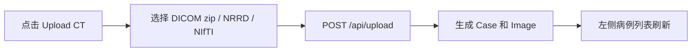
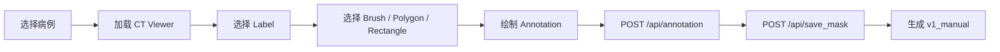
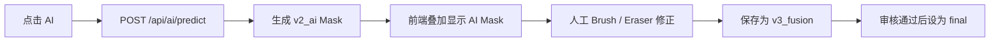
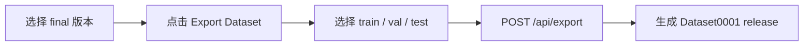

# 平台原型图：Day1 UI 设计

## 1. 设计目标

今天只确定 UI，不写 Vue。

第一页采用三栏式工作台：

```text
左边：病例列表
中间：CT 影像显示区
右边：工具栏 + 信息栏
```

核心目标：

- 标注人员打开页面后，先选病例，再看 CT，再用工具标注。
- AI 标注按钮和人工工具放在同一个右侧区域，方便人机协同。
- 保存、版本、导出入口直接露出，避免后续流程混乱。

## 2. 页面线框图

```text
┌──────────────────────────────────────────────────────────────────────────────────────────────┐
│ C Group Medical Annotation Platform                                                           │
├───────────────────────┬──────────────────────────────────────────────┬───────────────────────┤
│ 病例 Case List         │ CT Viewer                                     │ Tools / Info          │
│                       │                                              │                       │
│ [Search Case...]      │ ┌──────────────────────────────────────────┐ │ Label                 │
│                       │ │                                          │ │ [lung_nodule     v]  │
│ ○ Case0001            │ │                                          │ │                       │
│   Patient: LUNG1-001  │ │              CT Slice Display            │ │ Tool                  │
│   Status: annotating  │ │                                          │ │ [Brush]               │
│                       │ │          Mask Overlay / ROI Boundary     │ │ [Polygon]             │
│ ● Case0002            │ │                                          │ │ [Rectangle]           │
│   Patient: LUNG1-002  │ │                                          │ │ [Eraser]              │
│   Status: reviewed    │ └──────────────────────────────────────────┘ │ [AI]                  │
│                       │                                              │                       │
│ ○ Case0003            │ Slice: [ 42 / 134 ]   HU: -620              │ Brush Size             │
│   Patient: LUNG1-003  │ Zoom: 100%            X: 130 Y: 220         │ [----●----------]      │
│   Status: exported    │                                              │                       │
│                       │ [Axial] [Coronal] [Sagittal]                │ Mask Opacity           │
│ [+ Upload CT]         │                                              │ [------●--------]      │
│                       │ Version: v1_manual | v2_ai | final          │                       │
│                       │                                              │ Actions               │
│                       │                                              │ [Undo] [Redo]          │
│                       │                                              │ [Save] [Review]        │
│                       │                                              │ [Export Dataset]       │
│                       │                                              │                       │
│                       │                                              │ Current Mask           │
│                       │                                              │ Mask0001               │
│                       │                                              │ Version: v1_manual     │
└───────────────────────┴──────────────────────────────────────────────┴───────────────────────┘
```

## 3. 页面区域说明

### 3.1 左侧：病例区

功能：

- 显示病例列表。
- 搜索病例。
- 显示病例状态。
- 上传 CT。
- 点击病例后加载中间 CT Viewer。

字段：

```text
case_id
patient_id
modality
status
create_time
```

病例状态：

```text
unannotated
annotating
annotated
reviewed
exported
archived
```

### 3.2 中间：CT 影像区

功能：

- 显示 CT 切片。
- 支持切片切换。
- 显示 mask 叠加层。
- 显示 ROI 边界。
- 显示鼠标坐标和 HU 值。
- 支持 Axial、Coronal、Sagittal 三视图切换。
- 支持版本切换：`v1_manual`、`v2_ai`、`v3_fusion`、`final`。

需要从 API 获取：

```text
GET /api/case/{case_id}
GET /api/image/{image_id}
GET /api/image/{image_id}/slice/{slice_index}
GET /api/image/{image_id}/masks
GET /api/case/{case_id}/versions
```

### 3.3 右侧：工具栏和信息区

工具：

```text
Brush
Polygon
Rectangle
Eraser
AI
Undo
Redo
Save
Review
Export Dataset
```

参数：

```text
label
brush_size
mask_opacity
current_version
current_mask
```

主要操作：

- `Brush`：自由画笔标注。
- `Polygon`：多边形标注。
- `Rectangle`：矩形框标注。
- `Eraser`：擦除 mask。
- `AI`：调用自动标注。
- `Save`：保存当前 annotation 和 mask。
- `Review`：将当前版本设为 final 或退回修改。
- `Export Dataset`：导出 train/val/test 数据集。

## 4. 核心交互流程

### 4.1 上传病例



### 4.2 人工标注并保存



### 4.3 AI 标注并人工修正



### 4.4 导出 Dataset



## 5. UI 与数据表关系

| UI 区域 | 读取/写入的表 |
| --- | --- |
| 病例列表 | `cases` |
| CT Viewer | `images` |
| 标注工具 | `annotations` |
| Mask 叠加层 | `masks` |
| AI 按钮 | `models`、`annotations`、`masks`、`versions` |
| 版本切换 | `versions` |
| 导出 Dataset | `datasets`、`versions` |

## 6. Day1 UI 结论

第一页原型固定为：

```text
病例列表 -> CT 显示 -> 标注工具/AI/保存/导出
```

后续写 Vue 时不要先做复杂首页、介绍页或无关菜单，第一屏就做真实标注工作台。

