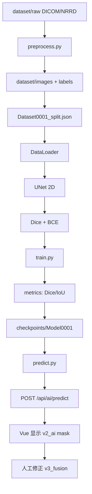

# Person B — AI 模块 Day1 交付说明

> 对齐文档：[01 数据流与命名标准](01_data_flow_file_naming_standard.md)、[02 样例数据分析](02_example_data_analysis.md)、[04 API 设计](04_api_design.md)、[06 GitHub 协作](06_github_workflow.md)

## Day1 目标

**不写 U-Net 训练代码**，只完成 AI 训练框架与数据读取约定，确保与 Person A 平台接口一致。

## 已完成目录

```text
ai/
  config.py          # 命名、路径、超参、版本 tag
  preprocess.py      # Day2: load/normalize/resize/crop/save 已实现
  augment.py         # Day2: 训练时 flip/rotate/brightness
  pipeline.py        # Day2: Lung 样例转换 + raw 上传后处理
  train.py           # Day4: 完整训练循环
  predict.py         # 推理响应 schema（对接 /api/ai/predict）
  loss.py            # Day4: Dice + BCE 已实现
  metrics.py         # Dice / IoU 工具函数
  models/unet.py     # Day4: 2D U-Net encoder-decoder
  datasets/lung_dataset.py   # Day3: manifest + split + DataLoader
  checkpoints/       # gitignore，本地训练输出
  runs/              # gitignore，训练日志
```

## 训练流程（Day1 流程图）



## 与 Person A 对齐的关键约定

| 项目 | 约定 |
|------|------|
| case_id | `Case0001`（内部 ID，外部 LUNG1-001 见 split mapping） |
| mask 路径 | `dataset/labels/Case0001/v2_ai/Case0001_Image0001_Mask0001_v2_ai_lung_nodule.png` |
| 版本 | `v1_manual` / `v2_ai` / `v3_fusion` / `final` |
| AI 读数据 | 只从 `dataset/` 读取，不读临时上传目录 |
| 推理接口 | `POST /api/ai/predict`，响应见 `ai/predict.py` |

## 样例数据映射（来自 docs/02）

| 内部 Case | 外部 PatientID | 说明 |
|-----------|----------------|------|
| Case0001 | LUNG1-001 | DICOM CT + SEG |
| Case0002 | LUNG1-002 | DICOM CT + SEG |
| Case0003 | LUNG1-003 | DICOM CT + SEG |
| Case0004 | patient1 | NRRD p1.nrrd + p1-label.nrrd（手动金标准） |

## 本地验证

```bash
python ai/train.py
python ai/predict.py
python -c "from ai.metrics import dice_score; import numpy as np; print(dice_score(np.ones((4,4)), np.ones((4,4))))"
```

## Day2 已完成（详见 [08_person_b_day2.md](08_person_b_day2.md)）

1. `preprocess.py` / `augment.py` / `pipeline.py` 已实现
2. `scripts/convert_lung_examples.py` 将 Lung 样例导出到 `dataset/images` + `dataset/labels`
3. `Dataset0001_manifest.json` 已更新 4 个 case 路径
4. Day3 已完成：见 [09_person_b_day3.md](09_person_b_day3.md)
5. Day4 已完成：见 [10_person_b_day4.md](10_person_b_day4.md)（UNet2D + 训练循环）
6. Day5 已完成：见 [11_person_b_day5.md](11_person_b_day5.md)（第一版 Model0001 完整训练）
7. Day6：`predict.py` 推理 + 对接 Person A

## 17:00 与 Person A 确认项

- [ ] `POST /api/save_mask` 路径是否与 `ai/config.py` 的 `label_path()` 一致
- [ ] Day1 训练输入用 PNG 还是 NIfTI
- [ ] `feature-a` 上传接口返回的 `case_id` 是否已是 `Case0001` 格式
